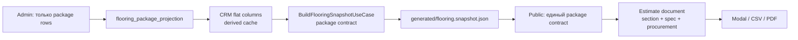

# Аудит package-first: раздел «Полы»

Дата: 2026-06-04
Область: backend DB/API, snapshot, admin catalog-editor, public calculator, generated snapshot, тесты
Цель: зафиксировать текущий разрыв между пакетной моделью и flat/fallback-логикой, затем перестроить раздел «Полы» под принцип «нет валидного пакета — нет позиции».

## A. Текущее состояние

### Цепочка сегодня

```mermaid
flowchart LR
  subgraph admin [Admin CRM]
    FlatForms["FlooringCatalogEditForms\nflat ₽/м²"]
    AsmUI["FlooringAssemblyBlock\nassembly rows"]
    FlatForms -->|POST/PATCH| CatAPI["/api/calculator/flooring/*"]
    AsmUI -->|PUT assembly| AsmAPI["/api/calculator/flooring/{kind}/{id}/assembly"]
  end

  subgraph db [DB]
    FlatTbl["estimate_flooring_coverings\npreparations / layouts"]
    AsmTbl["estimate_flooring_catalog_assemblies\n+ assembly_rows"]
  end

  CatAPI --> FlatTbl
  AsmAPI --> AsmTbl
  AsmAPI -->|catalog_updates if enabled rows| FlatTbl

  subgraph snap [Snapshot]
    UC["BuildFlooringSnapshotUseCase"]
    Def["DEFAULT_PUBLIC_FLOORING_SNAPSHOT\n+ merge by code"]
    Gen["prebuild: generate-snapshot.js"]
    JSON["generated/flooring.snapshot.json"]
    UC --> Def --> Gen --> JSON
  end

  FlatTbl --> UC
  AsmTbl --> UC

  subgraph public [Public UI]
    Calc["calculateFlooring\nflat rates"]
    Spec["buildFlooringSpecification\nspecLines OR flat fallback"]
    Proc["buildFlooringProcurementSummary"]
    JSON --> Calc --> Spec
    JSON --> Proc
  end
```



### Что уже близко к package-first

| Область | Что сделано | Ключевые места |
|---|---|---|
| DB + REST assembly | Таблицы пакетов и строк пакетов уже есть | migration `0013`, `replace_estimate_flooring_catalog_assembly` |
| Проекция flat из пакета | Пакет умеет пересчитывать derived flat-поля | `build_flooring_package_projection`, `catalog_update_values_from_projection` |
| Блокировка flat PATCH | Если assembly-запись существует, прямой PATCH flat-полей отклоняется | `reject_flooring_flat_update_when_assembly_present` |
| Snapshot specLines | Из enabled rows строятся `specLines`; covering публикует их только при полноте | `_attach_spec_lines_to_snapshot_row`, `covering_spec_lines_are_complete` |
| Admin projection перед save | При enabled assembly rows draft пересчитывается перед PATCH | `flooring-package-projection.ts` |
| Создание из assembly | Create-from-assembly уже есть и требует хотя бы одну enabled row на frontend | `createFlooringCatalogRowFromAssembly` |
| Public spec/procurement | Есть разворот specLines и закупочная сводка | `buildFlooringSpecification`, `buildFlooringProcurementSummary` |

### Где flat/fallback еще управляет поведением

1. **Создание позиции каталога**
   `POST /coverings`, `POST /preparations`, `POST /layouts` все еще принимают flat-поля. Assembly не обязателен.

2. **Пустой или all-disabled assembly**
   PUT с `rows: []` или всеми `is_enabled = false` сохраняет shell. Flat-поля не пересчитываются, но прямой PATCH уже блокируется. Получается ломаная промежуточная сущность.

3. **Публикация snapshot**
   Global catalog rows без валидного пакета все равно попадают в public snapshot как flat rows или через merge с `DEFAULT_PUBLIC_FLOORING_SNAPSHOT`.

4. **Public calculator**
   `calculateFlooring()` считает итог по flat rates. `specificationSection` потом пытается развернуть `specLines`, а если их нет — fallback к flat items.

5. **Гибрид по комнатам**
   В одной смете часть позиций может быть package/specLines, часть flat fallback. Поэтому спецификация выглядит как смесь двух моделей.

6. **Локальный build**
   Без `PUBLIC_SNAPSHOT_BASE_URL` / `VITE_API_BASE_URL` prebuild перетирает generated snapshot локальным seed. Это ломает проверку локального сайта.

### Главный вывод по текущему состоянию

Инфраструктура пакетов уже есть, но package-first принцип не соблюден. Система все еще допускает позиции без валидного пакета и public все еще умеет жить по flat fallback.

## B. Целевое состояние

### Целевая цепочка



### Законы целевого контура

1. **Покрытие, подготовка, укладка — всегда пакет.**
   В админке не должно существовать самостоятельной flat-позиции.

2. **Flat rates — только derived projection/cache.**
   Их можно хранить для быстрых итогов, но нельзя редактировать как источник правды.

3. **Пакет без валидного состава не существует.**
   Пустой пакет, all-disabled пакет и пакет с ломаной формулой невалидны.

4. **Invalid package не публикуется.**
   Он не должен попадать в public snapshot ни как flat row, ни как `specLines`.

5. **Public не выбирает specLines vs fallback.**
   Public должен получать один нормализованный package contract.

6. **Export читает тот же estimate document, что и UI.**
   Modal, CSV и будущий PDF не должны иметь отдельные ветки расчета.

Open question: `plinthTypes` и `globalAddons` в v1 можно оставить вне package-first или тоже перевести в пакеты отдельной фазой.

## C. Правила валидации

### Уровень позиции

| target_kind | Минимум enabled rows | Статус сейчас |
|---|---|---|
| `covering` | минимум 1 enabled `material` | backend replace пока не требует |
| `preparation` | минимум 1 enabled `work` | backend replace пока не требует |
| `layout` | минимум 1 enabled `work` | backend replace пока не требует |

### Уровень enabled row

Обязательные поля:

- `title`
- `kind`
- `formula`
- `unit`
- `price >= 0`
- `public_title` для public projection/spec

Правила kind:

- `covering`: `material`, `consumable`, `tool`
- `preparation`: `work`
- `layout`: `work`

### Package procurement

Для package-aware формул нужны валидные закупочные параметры:

- `packageSize > 0`
- `packagePrice > 0`
- корректная единица упаковки
- корректный расход / слой / коэффициент, если это нужно формуле

Сейчас часть этих условий не является жесткой ошибкой: система может fallback-нуться в raw-расчет. Для package-first это надо ужесточить.

### Disabled rows

Disabled rows можно хранить, но:

- они не участвуют в projection;
- они не участвуют в snapshot;
- они не делают пакет валидным.

## D. План миграции

### Проблема

Seed и существующие global catalog rows могут быть flat-only. Они не имеют обязательных package assemblies. Если сразу запретить flat-only публикацию, в public появятся дыры.

### Варианты

| Вариант | Описание | Плюсы | Минусы |
|---|---|---|---|
| 1 | Synthetic package migration | Сохраняет существующие позиции и коды | Нужно аккуратно собрать строки из flat-полей |
| 2 | Hide until package | Простое правило публикации | Много позиций пропадет из калькулятора |
| 3 | Manual repair | Контроль руками | Не масштабируется и не закрывает seed/CI |

### Рекомендация

Выбрать **synthetic package migration**.

Причина: большая часть преобразований уже есть. Мы можем собрать технические пакеты из существующих flat-полей, затем считать их полноценными пакетами. Это сохранит public UX и закроет принцип «в админке нет непакетных данных».

Open questions:

- что делать с legacy `labor_price_per_m2` у covering;
- как мигрировать `custom_consumables_json`;
- какой уровень детализации у synthetic packages допустим для v1.

## E. Фазы внедрения

### PF1 — Backend validation hardening

Цель: backend не принимает пустые/ломаные пакеты.

Сделать:

- validation helper для package rows;
- `covering` требует enabled material;
- `preparation/layout` требуют enabled work;
- package-aware формулы требуют package params;
- PUT assembly с invalid rows возвращает 400;
- all-disabled/empty policy зафиксировать и покрыть тестами.

### PF2 — Synthetic packages migration

Цель: существующие global rows получают валидные технические пакеты.

Сделать:

- audit существующих rows без assembly;
- генератор synthetic assembly rows из flat полей;
- миграция/сидинг для global catalog;
- тесты на сохранение прежних публичных кодов.

### PF3 — Snapshot package contract

Цель: snapshot публикует только валидные package-first позиции.

Сделать:

- убрать публикацию invalid flat-only rows;
- сделать package/spec block обязательным для flooring catalog items;
- сузить или убрать `DEFAULT_PUBLIC_FLOORING_SNAPSHOT` merge для coverings/preparations/layouts;
- оставить default только там, где принято продуктово: например plinth/globalAddons.

### PF4 — Admin package-first save

Цель: в админке нельзя создать/сохранить позицию без пакета.

Сделать:

- create/save через package flow;
- flat forms перестают быть primary source;
- derived flat-поля показываются как расчетный результат;
- create flat-only routes либо запрещаются, либо становятся internal-only.

### PF5 — Public estimate document

Цель: public строит смету из единого package contract.

Сделать:

- убрать ветку `specLines OR flat fallback`;
- построить единый estimate document;
- flat rates использовать только как быстрый derived total, если это нужно;
- спецификация и procurement строятся из одного источника.

### PF6 — Modal/export/PDF readiness

Цель: UI, CSV и будущий PDF читают один estimate document.

Сделать:

- единая структура строк;
- единый формат итогов;
- CSV без отдельной логики fallback;
- подготовить PDF как отдельный renderer над тем же документом.

### PF7 — Local dev snapshot reliability

Цель: локальная разработка не ломается из-за seed snapshot.

Сделать:

- зафиксировать ENV для remote snapshot;
- добавить команду для локального package-first build;
- подумать о fail-fast, если build перетирает актуальный remote snapshot seed-ом;
- документировать dev flow.

### PF7b — Runtime snapshot refresh on page load

Цель: публичный сайт после загрузки страницы пробует получить свежий snapshot из backend, но не становится полностью зависимым от backend.

Решение:

- bundled `generated/*.snapshot.json` остается стартовым и fallback snapshot;
- при загрузке страницы frontend делает один background GET к `/api/public/catalog/{section}/snapshot`;
- если remote snapshot валиден и version/contract поддерживаются, runtime loader заменяет bundled snapshot в памяти;
- если backend недоступен или payload invalid, сайт остается на bundled snapshot и не ломает калькулятор;
- периодический polling не нужен на первом этапе;
- для dev/prod должен быть явный признак источника данных: `bundled` или `remote`;
- package-first gates из PF8 применяются одинаково к bundled и remote snapshot.

Почему это нужно:

- админские изменения смогут появляться на сайте после перезагрузки страницы без ручного `snapshot:remote:local`;
- build snapshot остается safety fallback;
- мы не возвращаемся к live DB без валидации: сайт принимает только public snapshot contract.

Проверки:

- bundled snapshot используется до remote ответа;
- valid remote snapshot заменяет bundled данные;
- invalid remote snapshot не заменяет bundled данные;
- flooring dropdown после reload страницы видит новую package-backed позицию из backend;
- нет бесконечного polling и лишней нагрузки на API.

### PF8 — E2E chain

Цель: одна проверка всей цепочки.

Сценарий:

1. Admin создает/обновляет package.
2. Backend snapshot отдает package contract.
3. Runtime loader на загрузке страницы получает fresh remote snapshot или использует bundled fallback.
4. Generated snapshot получает эти данные для build/deploy fallback.
5. Public dropdown видит позицию.
6. Public estimate считает итог.
7. Specification/CSV показывает состав и закупку.

## F. Файлы для контроля

### Backend

- `src/supply_bot/storage_estimates/tables.py`
- `migrations/versions/0013_create_flooring_catalog_assemblies.py`
- `src/supply_bot/storage_estimates/flooring_repository.py`
- `src/supply_bot/estimates/application/flooring_package_projection.py`
- `src/supply_bot/estimates/application/flooring_catalog_assembly.py`
- `src/supply_bot/estimates/application/flooring_snapshot.py`
- `src/supply_bot/estimates/application/update_flooring_catalog.py`
- `src/supply_bot/estimates/application/create_flooring_catalog.py`
- `src/supply_bot/admin_api/calculator_routes/flooring.py`
- `src/supply_bot/storage_bootstrap/seeding_flooring.py`
- `src/supply_bot/storage_estimates/flooring_assembly_seed.py`

### Backend tests

- `tests/test_flooring_package_projection.py`
- `tests/test_flooring_package_backend_consistency.py`
- `tests/test_public_flooring_snapshot_whitelist.py`
- `tests/test_admin_calculator_flooring_routes.py`
- `tests/test_storage_estimates_flooring_catalog_assembly.py`

### Frontend admin

- `admin-ui/src/features/catalog-editor/useFlooringCatalogPanel.ts`
- `admin-ui/src/features/catalog-editor/flooring-package-projection.ts`
- `admin-ui/src/features/catalog-editor/flooring-catalog-assembly-save.ts`
- `admin-ui/src/features/catalog-editor/flooring-catalog-assembly-edit-save.ts`
- `admin-ui/src/features/catalog-editor/flooring-catalog-assembly-create-row.ts`
- `admin-ui/src/features/catalog-editor/api/flooring-mappers.ts`
- `admin-ui/src/features/catalog-editor/api/flooring-client.ts`

### Frontend public + scripts

- `admin-ui/src/features/public/public-estimate-flooring.ts`
- `admin-ui/src/features/public/public-estimate-flooring-spec.ts`
- `admin-ui/src/features/public/public-estimate-flooring-procurement.ts`
- `admin-ui/src/features/public/public-flooring-snapshot.ts`
- `admin-ui/src/features/public/estimate/spec.ts`
- `admin-ui/src/features/public/estimate/useFlooringEstimate.ts`
- `admin-ui/src/features/public/estimate/spec-export.ts`
- `admin-ui/scripts/generate-snapshot.js`

### Frontend tests

- `admin-ui/src/features/public/public-estimate-flooring-spec.test.ts`
- `admin-ui/src/features/public/public-estimate-flooring-procurement.test.ts`
- `admin-ui/src/features/public/estimate/spec-export.test.ts`
- `admin-ui/src/features/public/public-flooring-snapshot.test.ts`
- `admin-ui/src/features/catalog-editor/flooring-package-projection.test.ts`
- `admin-ui/tests/smoke/flooring.spec.ts`

## G. Test plan

### Backend

- Unit tests для `validate_flooring_package_for_publication`.
- Route tests для invalid PUT assembly.
- Route tests для create без package после PF4.
- Snapshot tests: invalid package не попадает в payload.
- Migration tests: flat rows получают synthetic package.

### Frontend admin

- Validation tests: covering требует material, preparation/layout требуют work.
- Save flow tests: нельзя создать позицию без валидного package.
- Projection tests: flat-поля считаются только из rows.

### Frontend public

- Package-only snapshot fixture.
- Убрать или пометить legacy тесты `flat when no specLines`.
- Проверка, что specification и procurement строятся из одного package contract.

### E2E

1. Поднять backend с DB после migration.
2. Собрать `generated/flooring.snapshot.json` из remote API.
3. Открыть public estimate.
4. Проверить dropdown, итог, спецификацию, CSV.
5. Проверить, что в CSV нет flat fallback строк там, где пакет валиден.

### Local dev ENV

| Переменная | Назначение |
|---|---|
| `PUBLIC_SNAPSHOT_BASE_URL` | remote snapshot, приоритет |
| `VITE_API_BASE_URL` | fallback API base |
| не заданы | local seed fallback |

## Open Questions

1. Пустой assembly shell: запрещать PUT с 0 enabled или удалять assembly?
2. All-disabled: считать invalid или автоматически delete?
3. `DEFAULT_PUBLIC_FLOORING_SNAPSHOT` после PF3: убрать полностью или оставить только для `plinthTypes` / `globalAddons`?
4. Нужен ли в snapshot явный `package: { version, rows[] }` рядом со `specLines`?
5. Переводить ли `plinthTypes` и `globalAddons` в package-first в первой версии?

## Заключение

Система уже имеет примерно 60–70% инфраструктуры package-first: assembly DB/REST, projection, flat consistency guard, specLines, procurement hooks.

Но главный принцип еще не выполнен:

- flat rows все еще могут быть источником публикации;
- позиции без валидного package все еще возможны;
- public все еще живет в режиме `specLines OR flat fallback`;
- local build может случайно откатить generated snapshot в seed.

Минимальный набор фаз, чтобы «Полы» стали стабильным шаблоном для остальных разделов:

```text
PF1 → PF2 → PF3 → PF4 → PF7 → PF8
```

После решения runtime refresh:

```text
PF1 → PF2 → PF3 → PF4 → PF7 → PF7b → PF8
```

После этого:

```text
PF5 → PF6
```

для единого public estimate document, CSV и будущего PDF.
