# Package Engine Architecture Plan

Дата: 2026-06-04

Статус: целевой план внедрения. Документ фиксирует не только полы, а общую пакетную систему для всего публичного калькулятора и админки.

## 1. Зачем этот трек

Текущая проблема: часть калькулятора уже умеет собирать пакеты в админке, но публичный сайт все еще может жить от плоских ставок, fallback-метрик и старых snapshot-строк. Из-за этого получается хрупкий мост:

- админка собирает пакет;
- backend может публиковать `specLines`;
- public calculator продолжает считать и показывать раздел как набор flat-строк;
- спецификация выглядит как простыня, а не как понятная смета по выбранным пакетам.

Цель трека: сделать единую package-first систему, которая масштабируется на все разделы калькулятора: полы, сантехника, стены, потолки, электрика, теплый пол, двери, комплектация и будущие разделы.

Полы являются пилотным разделом. Но контракты, loaders, estimate document, validation и export должны быть общими, а не зашитыми только под полы.

## 2. Главный закон

В публичном калькуляторе не должно существовать самостоятельных непакетных позиций.

Публичная позиция каталога - это пакет.

Flat-ставки допустимы только как производная проекция пакета для быстрых итогов. Они не являются отдельным источником правды.

Если у позиции нет валидного пакета, она:

- не публикуется в public snapshot;
- не попадает в dropdown;
- не участвует в расчете;
- не попадает в спецификацию;
- не замещается silently hardcoded fallback-строкой.

## 3. Что считаем пакетом

Пакет - это публично выбираемая позиция калькулятора, собранная из строк состава.

Примеры:

- Полы: `Керамогранит 120x60`, `Грунтование`, `Крупный формат`.
- Сантехника: зона/пакет точки подключения, комплект работ и материалов.
- Стены: покрытие, подготовка, способ нанесения.
- Потолки: тип потолка, подготовка, закладные.
- Электрика: тип точки, группа, линия, комплект материалов и работ.

Пакет имеет:

- публичный код;
- название;
- раздел;
- тип цели внутри раздела;
- строки состава;
- flat projection;
- specification lines;
- procurement metadata;
- версию контракта;
- признак валидности.

## 4. Единая модель данных

### 4.1 Package

```ts
type PublicPackage = {
  code: string;
  title: string;
  section: string;
  targetKind: string;
  version: string;
  flatProjection: PackageFlatProjection;
  specLines: PackageSpecLine[];
  procurement?: PackageProcurementMeta;
};
```

### 4.2 Package line

Строка состава пакета. В админке она может ссылаться на библиотеку кубиков, но в public snapshot должна быть уже безопасной копией.

Обязательные публичные поля:

- `code`;
- `title`;
- `category`: `works`, `materials`, `consumables`, `tools`, при необходимости расширяется;
- `basis`: площадь, штуки, метр, зона, точка, помещение;
- `unit`;
- `quantityPerBasis`;
- `unitPrice`;
- `calculationNote`, если нужна понятная расшифровка;
- procurement-поля, если строка закупается упаковками.

Запрещенные публичные поля:

- DB id;
- owner id;
- internal note;
- source;
- raw CRM JSON;
- timestamps;
- себестоимость, маржа, risk;
- любые private/admin-only поля.

### 4.3 Flat projection

Flat projection - это кэш итоговых ставок пакета.

Для полов это может быть:

- материал за м2;
- работа за м2;
- расходники за м2;
- запас;
- коэффициент укладки.

Для других разделов projection будет отличаться. Например:

- сантехника: цена зоны, точки, группы;
- электрика: цена точки, линии, группы;
- потолки: цена м2, погонного метра, закладной;
- двери: комплект двери, доборы, монтаж.

Projection всегда считается из строк пакета. Ручное редактирование projection как источника правды запрещено.

### 4.4 Estimate document

Публичная смета должна строиться из одного нормализованного документа:

```ts
type PublicEstimateDocument = {
  sections: EstimateDocumentSection[];
  totals: EstimateDocumentTotals;
};

type EstimateDocumentSection = {
  sectionId: string;
  title: string;
  groups: EstimateDocumentGroup[];
  totals: EstimateDocumentTotals;
};

type EstimateDocumentGroup = {
  scopeLabel: string;       // помещение, зона, группа, объект
  selectedPackages: EstimateSelectedPackage[];
  totals: EstimateDocumentTotals;
};

type EstimateSelectedPackage = {
  packageCode: string;
  title: string;
  targetKind: string;
  lines: EstimateDocumentLine[];
  procurementLines: EstimateProcurementLine[];
  totals: EstimateDocumentTotals;
};
```

UI, CSV и будущий PDF читают этот же документ. Не должно быть трех разных логик для модалки, CSV и PDF.

## 5. Целевая цепочка

```mermaid
flowchart LR
  Admin["Admin: package builder"]
  Library["Library: reusable cubes"]
  Backend["Backend: validation + projection"]
  DB["DB: package + rows + projection cache"]
  Snapshot["Public snapshot gateway"]
  Loader["Public package loader"]
  Calc["Section adapter calculation"]
  Doc["Estimate document"]
  Render["Modal / CSV / PDF"]

  Library --> Admin
  Admin --> Backend
  Backend --> DB
  DB --> Snapshot
  Snapshot --> Loader
  Loader --> Calc
  Calc --> Doc
  Doc --> Render
```



## 6. Конечный результат

В конце трека система должна работать так:

1. Администратор собирает позицию из кубиков.
2. Backend валидирует пакет.
3. Если пакет пустой, битый или неполный, он не сохраняется как публичная позиция.
4. При сохранении backend считает flat projection и сохраняет его атомарно со строками пакета.
5. Public snapshot публикует только валидные package-backed позиции.
6. Публичный калькулятор строит dropdown только из package snapshot.
7. Пользователь выбирает понятную позицию: покрытие, подготовку, укладку, зону, точку, пакет работ и т.д.
8. Итоговые суммы считаются из package projection.
9. Спецификация раскрывает состав пакета, а не показывает плоский суп строк.
10. Закупочный блок показывает упаковки, мешки, пачки, литры, штуки как справочную часть.
11. CSV и PDF используют тот же estimate document, что и модалка.
12. Если snapshot битый, build/test падает. Сайт не молча откатывается на hardcoded fallback.

Для пользователя итоговая смета должна быть не закупочной накладной, а понятным коммерческим документом:

- что выбрано;
- где выбрано;
- из каких работ и материалов состоит;
- сколько стоит;
- какие материалы ориентировочно потребуются;
- какие итоги по разделам и по проекту.

## 7. Неприемлемые состояния

Эти состояния считаются ошибкой, а не допустимым fallback:

- public snapshot v2/vNext содержит позицию без `specLines`;
- dropdown показывает позицию без валидного пакета;
- расчет использует hardcoded rates при валидном package snapshot;
- пакет сохраняется пустым;
- all-disabled пакет считается валидным;
- flat PATCH меняет package-backed позицию в обход package projection;
- CSV показывает другую структуру, чем модалка;
- PDF строит свою отдельную модель;
- private/owner/internal поля попадают в public snapshot;
- локальный build случайно перетирает remote package snapshot старым seed без явного режима.

## 8. Архитектурные слои

### PE1. Package contract

Сделать общий контракт package snapshot, который не зависит от пола.

Результат:

- общие типы `PublicPackage`, `PackageSpecLine`, `PackageProcurementLine`;
- список разрешенных публичных полей;
- единый forbidden-key validator;
- versioning contract;
- разделы используют adapters, а не свои несовместимые payloads.

### PE2. Backend package validation

Общие правила валидации:

- пакет имеет минимум одну enabled строку;
- строка имеет название, категорию, единицу, формулу и цену;
- package-aware формулы требуют упаковку или явно работают в raw mode;
- section adapter проверяет domain-specific правила;
- invalid package возвращает ошибку до записи или до публикации.

Результат:

- нельзя сохранить публичный package-shell без полезного состава;
- нельзя опубликовать битый пакет;
- flat projection не расходится со строками.

### PE3. Package projection engine

Общий engine считает:

- flat projection;
- spec lines;
- procurement metadata.

Section adapters задают только domain rules:

- flooring: площадь, запас, слой, упаковки;
- plumbing: зоны, точки, комплекты;
- walls: площадь, слои, материалы;
- ceilings: площадь, периметр, закладные;
- electrical: точки, линии, группы.

Результат:

- новая секция не пишет свой отдельный mini-engine с нуля;
- формулы проверяемы и тестируемы;
- projection и specification имеют один источник.

### PE4. Public snapshot gateway

Snapshot любого раздела публикует только package-backed позиции.

Результат:

- build-time JSON содержит package contract;
- runtime API и generated JSON совпадают по форме;
- remote generation fail-fast при битом payload;
- local seed явно package-first.

### PE5. Public package loader

Общий loader:

- валидирует package snapshot;
- строит dropdown options;
- отдает projection для быстрых итогов;
- отдает spec/procurement для estimate document.

Результат:

- public UI не держит hardcoded options как нормальный путь;
- fallback допускается только как dev seed, а не как production behavior;
- custom/admin-created позиции появляются на сайте после snapshot generation.

### PE6. Estimate document renderer

Сделать общий estimate document.

Результат:

- модалка, CSV и PDF используют одну структуру;
- строки сгруппированы по разделу, помещению/зоне и пакету;
- закупка показывается отдельно как справочная сводка;
- public estimate выглядит как смета, а не как технический лог строк.

### PE7. Flooring pilot completion

Полы довести до package-first полностью.

Acceptance:

- local backend snapshot `flooring-v2` не содержит непакетных покрытий, подготовок и укладок;
- dropdown полов берет только package-backed позиции;
- расчет использует projection пакета;
- specification раскрывает пакет;
- procurement показывает упаковки;
- CSV показывает тот же estimate document;
- нет flat fallback в package-first пути.

### PE8. Rollout to other sections

После полов переносить не код копипастой, а общий слой:

- сантехника;
- стены;
- потолки;
- электрика;
- теплый пол;
- двери;
- комплектация.

Для каждого раздела добавляется только section adapter и domain-specific library rows.

## 9. План внедрения

### Step 0. Freeze the target

Зафиксировать этот документ как источник правды.

Не начинать новые UI-фичи, пока не закрыты:

- package contract;
- snapshot gateway;
- estimate document;
- flooring pilot acceptance.

### Step 1. Audit current flooring bridge

Проверить:

- backend runtime действительно на текущем `main`;
- `/api/public/catalog/flooring/snapshot` отдает только package-backed rows;
- generated snapshot совпадает с runtime;
- public dropdown не берет старые hardcoded строки;
- specification не fallback-ится в flat section.

### Step 2. Remove flooring flat fallback from public path

Для package-first flooring:

- v2/vNext без `specLines` invalid;
- no package means no public item;
- `calculateFlooring` использует projection только как derived package projection;
- fallback-тесты оставить только для legacy v1 fixtures, не для основной логики.

### Step 3. Build package-view estimate document

Для полов:

- группировать по помещению;
- внутри помещения группировать выбранные пакеты;
- внутри пакета показывать работы, материалы, расходники, инструмент;
- закупку вынести отдельной сводкой.

### Step 4. Connect CSV to estimate document

CSV должен экспортировать тот же document, что видит пользователь.

Не отдельная procurement-only таблица и не старая flat-простыня.

### Step 5. Prepare PDF renderer

PDF с логотипом строится поверх estimate document.

Минимум:

- логотип/бренд;
- данные проекта;
- разделы;
- пакеты;
- строки состава;
- итоги;
- справочная закупка;
- дисклеймер по ориентировочности закупки.

### Step 6. Generalize after flooring pilot

Когда полы проходят acceptance, выделить общий слой:

- package contract types;
- package snapshot validator;
- estimate document builder;
- procurement aggregator;
- export renderer;
- section adapter interface.

Только после этого переносить на сантехнику и остальные разделы.

## 10. Acceptance criteria

### Backend

- Invalid package не сохраняется или не публикуется.
- Empty/all-disabled package не публикуется.
- Flat PATCH не меняет package-backed позицию в обход пакета.
- Owner/private data не попадает в public snapshot.
- Snapshot tests падают при public item без package.

### Frontend

- Dropdown options берутся из package snapshot.
- Package snapshot validator падает на missing `specLines`.
- Public calculation не зависит от hardcoded rates в package-first режиме.
- Specification показывает package-view.
- CSV и PDF читают один estimate document.

### Local E2E

1. Создать или изменить пакет в админке.
2. Перезапустить/обновить backend, если требуется.
3. Сгенерировать snapshot из backend.
4. Открыть public calculator.
5. Увидеть позицию в dropdown.
6. Рассчитать смету.
7. Открыть спецификацию.
8. Увидеть состав пакета.
9. Скачать CSV/PDF.
10. Убедиться, что экспорт совпадает с модалкой по смыслу и итогам.

### Production readiness

- Remote snapshot generation не проходит, если backend отдает старый flat payload.
- Release не выполняется, если local generated snapshot не package-first.
- Нельзя опубликовать раздел, где package-first path не покрыт тестами.

## 11. Что не входит в этот трек

- Визуальная полировка UI/CSS.
- Маркетинговые тексты лендинга.
- Редизайн публичного калькулятора.
- Перенос всех разделов сразу.
- PDF-дизайн как отдельная визуальная задача до готового estimate document.

UI можно править параллельно, но он не должен менять contract и business logic.

## 12. Первый практический следующий шаг

Следующая задача агенту:

1. Проверить runtime drift для flooring backend.
2. Добиться, чтобы `/api/public/catalog/flooring/snapshot` на локальном backend отдавал package-first payload.
3. Убрать или ограничить public flat fallback для flooring v2.
4. Собрать package-view estimate document для полов.
5. Проверить dropdown, modal, CSV на локальном сайте.

После этого будет понятно, достаточно ли текущей модели для переноса на сантехнику или нужно сначала выделять общий package engine.

