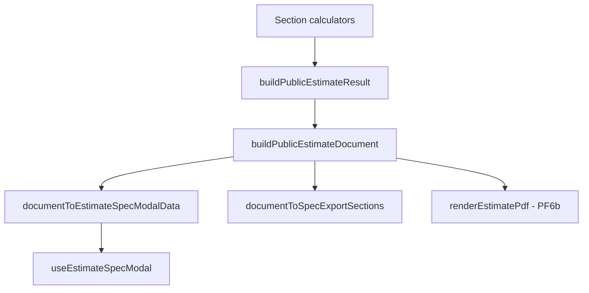

# PF5 — План внедрения `PublicEstimateDocument`

**Дата:** 2026-06-05  
**Статус:** аудит + план реализации (без builder, без UI/CSS, без backend, без generated JSON)  
**Связано:** `docs/package-engine-architecture-plan.md` (§4.4, §13.10–13.11, PF5/PF6), `docs/pf6-public-estimate-document-plan.md`

**Ограничения:** не менять `calculateFlooring()` формулы до явного PF5 flip; не трогать snapshot/generate; PF6 PDF — только подготовка типов/адаптеров.

---

## 1. Где рождается `PublicEstimateResult` и где живут итоги

### 1.1 Рождение `PublicEstimateResult`

| Шаг | Файл | Функция | Строки |
|-----|------|---------|--------|
| Секционные калькуляторы | `admin-ui/src/features/public/estimate/useFlooringEstimate.ts` и др. | `calculateFlooring`, `calculatePlumbing`, … | flooring: ~65–74 |
| Сборка сметы | `admin-ui/src/features/public/PublicEstimate.tsx` | `useMemo` → `buildPublicEstimateResult` | ~244–259 |
| Агрегатор | `admin-ui/src/features/public/estimate/engine.ts` | `buildPublicEstimateResult` | 22–55 |
| Модель | `admin-ui/src/features/public/public-estimate-model.ts` | `PublicEstimateResult`, `calculateEstimateTotals` | 51–54, 92–111 |

`buildPublicEstimateResult` включает только разделы с ненулевой площадью/позициями (warm_floor/flooring/walls/ceiling по area; остальные — `items.length > 0`). Grand total = `calculateEstimateTotals(sections, floorArea)` — сумма **flat** `section.items` всех включённых разделов.

### 1.2 Итоги по слоям (полы — эталон дрейфа)

| Слой | Источник totals | Файл / место |
|------|-----------------|--------------|
| **Калькулятор (карточка полов)** | `flooringResult.total` = `section.totals.total` после flat `createEstimateSection` | `public-estimate-flooring.ts` 368, 384–392; UI `summary.ts` `buildFlooringSummaryItems` ~74–82 |
| **Смета (паспорт / Costs)** | `estimateResult.totals` из flat sections | `PublicEstimate.tsx` ~278–279, ~587–588; `CostsSection.tsx` |
| **Spec modal (строки)** | `expandFlooringSectionForSpec` → `specificationSection.items` (specLines + fallback flat) | `public-estimate-flooring-spec.ts` 291–303 |
| **Spec modal (футер)** | `section.totals` **без пересчёта** (остаются flat) | `EstimateSpecOverlay.tsx` ~91, ~148, ~181 |
| **CSV (dev)** | `section.totals` + `grandTotal` reduce | `spec-export.ts` 63, 79, 101 |
| **Procurement** | Отдельный reduce по `FlooringProcurementLine.total` | `spec-export.ts` 142; не в modal UI (prop есть, рендера нет) |

**V12:** тест `expandFlooringSectionForSpec` явно фиксирует: items spec, totals flat (`public-estimate-flooring-spec.test.ts` ~869–888). Для пересчёта из строк есть `calculateSpecificationSectionItemTotals` (~305–308 в spec.ts), но modal/CSV его не вызывают.

---

## 2. Flooring: flat vs specLines (дрейф, ссылки)

### 2.1 Два пути в `calculateFlooring`

```text
roomResults → flat items (pickSnapshotRate, ~253–366)
           → createEstimateSection → section.totals  ← source of truth калькулятора
           → buildFlooringSpecification (spec.ts)
           → specificationLines + specificationSection (items заменены, totals = spread flatSection)
           → buildFlooringProcurementSummary
```

Ключевые файлы:

- Flat buckets: `public-estimate-flooring.ts` `calculateFlooring` **244–397**
- Spec expansion: `public-estimate-flooring-spec.ts` `buildFlooringSpecification` **193–288**, `expandSpecLinesForRoom` **119–164**, `computeFlooringSpecLineRawQuantity` **96–117**
- Modal swap: `expandFlooringSectionForSpec` **291–303** — только `items`, не `totals`
- Wiring: `estimate/spec.ts` `mapSectionsForSpec` **53–72** (flooring branch **66–68**)

### 2.2 Hybrid / fallback (V4, V5)

| Условие | Поведение | Строки |
|---------|-----------|--------|
| Нет specLines ни у одной комнаты | `specificationSection` = flat или global-only при packageFirst | 242–253 |
| Часть пакетов со specLines | `skippedFlatItemIds` + `fallbackFlatItems` для остальных комнат (если не packageFirst) | 209–239, 256–275 |
| `packageFirstMode` | Room flat fallback отключён; глобальные plinth/thresholds/demolition остаются | 265–267, `GLOBAL_FLAT_IDS` 62–67 |

Пакет в UI spec: только `note` = `sourceLabel` («Покрытие: …») через `specificationLineToEstimateLineItem` **166–178**; `roomName` в `FlooringSpecificationLine` не попадает в группировку modal.

### 2.3 Тесты, фиксирующие дрейф

- `public-estimate-flooring-spec.test.ts` — `calculateSpecificationSectionItemTotals` vs `flatSection.totals` (~431+)
- `public-flooring-package-first-e2e.test.ts` — calc → `expandFlooringSectionForSpec` → `buildSpecExportCsv` (~134–161)
- `estimate/spec-export.test.ts` — CSV columns с `section.totals`
- `public-estimate-flooring.test.ts` — flat fallback при отсутствии specLines (legacy; пометить к удалению после PF5)

---

## 3. Plumbing: паттерн zone/package expansion

| Элемент | Реализация |
|---------|------------|
| Тип modal section | `EstimateSpecSection` = `EstimateSection` + `specIntro?` — `public-estimate-plumbing-zones.ts` **823–825** |
| Опции | `buildPlumbingSpecExpansionOptions` — `estimate/spec.ts` **24–51** |
| Разворот | `expandPlumbingSectionForSpec` **980–1065**: `buildActiveZones` **883–976** → для zone-line `getZoneSpecItems(zoneId, packageLevel)`; legacy lines skip; `specIntro` из `disclaimer` |
| Wiring | `mapSectionsForSpec` plumbing branch **62–64** |
| Totals | `...section` — **totals не пересчитываются** после замены items (как у полов, если items меняются) |

Адаптер document: `scopeLabel` = title зоны / kitchen; `selectedPackages[]` = `{ packageCode: packageLevel, lines: atoms }`; `appendix.disclaimers` ← `specIntro`.

---

## 4. Данные для `PublicEstimateDocument`

| Блок | Сегодня | В document |
|------|---------|------------|
| **meta.generatedAt** | — | ISO client-side |
| **meta.title** | modal: «Полная спецификация» / section.title | из `EstimateSpecModalState` |
| **meta.object** | `EstimateObjectMeta` — `estimate/context.ts` **30–35**, `useEstimateObjectMeta` | опционально в builder context |
| **meta.brand** | `/brand/danko-logo-mark.png`, copy в `PublicEstimate.tsx` ~306–311 | `{ logoUrl, name, subtitle }` |
| **sections[]** | `estimateResult.sections` (flat) + adapters | `EstimateDocumentSection` per `EstimateSectionId` |
| **groups / packages / lines** | Только у flooring/plumbing в spec; остальные — flat list | adapters per section |
| **totals** | Разные источники (см. §1) | **единая политика:** sum included document lines |
| **appendices.procurement** | `flooringResult.procurementLines` | из `buildFlooringProcurementSummary` |
| **appendices.disclaimers** | plumbing `specIntro` | массив строк |
| **grand totals** | `PublicEstimateResult.totals` | `document.totals` + `pricePerSquareMeter` из `floorArea` |

**Не в document сегодня:** `specificationLines[]` как отдельный массив (дублирует lines после маппинга); geometry section не в `buildPublicEstimateResult`.

---

## 5. Можно ли ввести document без изменения UI

**Да — PF5a (shadow):**

1. Новый модуль `admin-ui/src/features/public/estimate/public-estimate-document.ts` (имя по конвенции PE §4.4).
2. `buildPublicEstimateDocument(result, context)` — pure function, без импорта в `PublicEstimate.tsx` / overlay.
3. Vitest: parity flooring golden fixture; plumbing smoke; flat sections passthrough.
4. Опционально: `documentToSpecExportSections()` для e2e вместо ручного `expandFlooringSectionForSpec` — **без** изменения `EstimateSpecOverlay`.

Калькулятор и `buildPublicEstimateResult` не трогаем до PF5c policy flip.

**Замечание:** CSV-кнопка уже снята с `EstimateSpecOverlay.tsx` (нет `downloadSpecExportCsv`); `spec-export.ts` остаётся для тестов — согласовано с `docs/pf6-public-estimate-document-plan.md`.

---

## 6. Предлагаемые типы

Согласовать с `package-engine-architecture-plan.md` §4.4 и расширить meta/appendix из PF6:

```ts
// estimate/public-estimate-document-types.ts (или в том же файле)

import type { EstimateObjectMeta } from "./context";
import type { EstimateCostCategory, EstimateSectionId, EstimateCategoryTotals } from "../public-estimate-model";
import type { FlooringProcurementLine } from "../public-estimate-flooring-procurement";

export type EstimateDocumentTotals = EstimateCategoryTotals & {
  pricePerSquareMeter?: number;
};

export type EstimateDocumentLine = {
  id: string;
  title: string;
  category: EstimateCostCategory;
  quantity: number;
  unit: string;
  unitPrice: number;
  total: number;
  isIncluded: boolean;
  note?: string;           // sourceLabel / «уточняется»
  roomName?: string;
  packageCode?: string;
  targetKind?: "covering" | "preparation" | "layout" | string;
};

export type EstimateSelectedPackage = {
  packageCode: string;
  title: string;
  targetKind: string;
  lines: EstimateDocumentLine[];
  procurementLines?: FlooringProcurementLine[];
  totals: EstimateDocumentTotals;
};

export type EstimateDocumentGroup = {
  scopeLabel: string;
  selectedPackages: EstimateSelectedPackage[];
  totals: EstimateDocumentTotals;
};

export type EstimateDocumentSection = {
  sectionId: EstimateSectionId;
  title: string;
  description?: string;
  specIntro?: string;
  groups: EstimateDocumentGroup[];
  /** Плоский fallback для разделов без PE (walls, electric, …) */
  flatLines?: EstimateDocumentLine[];
  totals: EstimateDocumentTotals;
};

export type PublicEstimateDocument = {
  meta: {
    generatedAt: string;
    title: string;
    estimateId?: string;
    object?: EstimateObjectMeta;
    brand?: { logoUrl: string; name: string; subtitle?: string };
    floorArea?: number;
  };
  sections: EstimateDocumentSection[];
  appendices?: {
    procurement?: FlooringProcurementLine[];
    disclaimers?: string[];
  };
  totals: EstimateDocumentTotals;
};
```

---

## 7. Архитектура



### 7.1 `buildPublicEstimateDocument(result, context)`

**Input `BuildPublicEstimateDocumentContext`:**

```ts
{
  floorArea: number;
  objectMeta?: EstimateObjectMeta;
  brand?: PublicEstimateDocument["meta"]["brand"];
  flooringResult: Pick<FlooringCalculationResult,
    "roomResults" | "specificationLines" | "specificationSection" | "procurementLines" | "section">;
  plumbingOptions: PlumbingOptions;
  plumbingResult: PlumbingCalculationResult;
  modalState?: EstimateSpecModalState; // для title/filter sections
}
```

**Алгоритм:**

1. Для каждого `result.sections` — `sectionDocumentAdapter(sectionId)`.
2. **Totals policy (PF5c):** `section.totals = sumIncludedLines(section.lines ∪ flatLines)`; `document.totals = sum(sections)`; `pricePerSquareMeter = total / floorArea`.
3. **Calculator policy (до flip):** `PublicEstimateResult` остаётся flat; document может **логировать drift** в dev-only assert test.

### 7.2 Адаптеры

| Adapter | Файл (новый/существующий) | Вход |
|---------|---------------------------|------|
| `buildFlooringDocumentSection` | `estimate/adapters/flooring-document.ts` | `roomResults`, `specificationLines`, `specificationSection`, `procurementLines`, catalog codes |
| `buildPlumbingDocumentSection` | reuse logic from `expandPlumbingSectionForSpec` | section + `ExpandPlumbingSectionForSpecOptions` |
| `buildFlatDocumentSection` | generic | `EstimateSection` → one group, `flatLines = items` |
| `documentToEstimateSpecModalData` | `estimate/spec.ts` refactor | document → текущий `EstimateSpecModalData` |
| `documentToSpecExportSections` | `estimate/spec-export.ts` или document module | `EstimateSpecSection[]` для CSV |

### 7.3 Totals policy (рекомендация)

| Фаза | Калькулятор | Document / modal / CSV |
|------|-------------|------------------------|
| PF5a | flat (unchanged) | document totals = sum(spec lines); **test** `document.totals` vs `flooringResult.total` |
| PF5c | optional: align `calculateFlooring` section totals to spec OR keep flat with documented delta | modal footer uses `document.sections[].totals` |
| PF6 | PDF uses document only | — |

Округление: как `formatExportNumber` — 2 знака (`spec-export.ts` 37–44); в builder — `safeMoney` / `Math.round(x*100)/100`.

---

## 8. Flooring adapter: входы

| Поле | Использование |
|------|----------------|
| `roomResults` | Группы `scopeLabel = roomName`; covering/preparation/layout codes |
| `specificationLines` | Канонические строки с `sourceLabel`, `roomName` |
| `specificationSection.items` | Fallback global lines (plinth, thresholds, demolition) |
| `procurementLines` | `appendices.procurement` + optional per-package bucket |
| `coveringByCode` / `preparationByCode` / `layoutByCode` | из `getFlooringSnapshotCatalog()` как в `calculateFlooring` 369–376 |

Структура группы:

```text
section (flooring)
  └── group (roomName)
        ├── package (covering, code, targetKind)
        ├── package (preparation)
        └── package (layout)
  └── flatLines (global items)
```

Переиспользовать: `expandSpecLinesForRoom`, `computeFlooringSpecLineRawQuantity`, `buildFlooringProcurementSummary` — **не дублировать** формулы.

---

## 9. Первый шаг: flooring-only vs generic shell

**Рекомендация: generic shell + flooring adapter first.**

| Подход | Плюсы | Минусы |
|--------|-------|--------|
| Flooring-only | Быстрее закрыть V12 | Второй PR для plumbing/flat; дублирование контракта |
| **Shell + adapters** | Сразу `buildFlatDocumentSection` для 8+ разделов; modal full-spec работает | Чуть больше кода в PF5a |

Минимум PF5a:

1. Типы + `buildPublicEstimateDocument` с `buildFlatDocumentSection` + `buildFlooringDocumentSection`.
2. Plumbing adapter — PF5a.1 или PF5b (можно initial passthrough: groups из expanded items без package metadata).

---

## 10. Поэтапный rollout

| Фаза | Scope | Файлы | Verification |
|------|-------|-------|--------------|
| **PF5a shadow** | Builder + tests, zero UI | `public-estimate-document.ts`, `*.test.ts` | `document.totals` vs calc; line count vs `specificationSection.items` |
| **PF5b modal adapter** | `buildEstimateSpecModalData` → document → view | `spec.ts`, опционально thin `useEstimateSpecModal` | `spec.test.ts` green; overlay без изменений props |
| **PF5c totals parity** | Modal footer + CSV adapter use document totals; решение по calc flip | `EstimateSpecOverlay.tsx` totals source; `spec-export` helper | обновить тест ~888 если policy = sum(lines); e2e CSV |
| **PF6a** | Убрать остатки CSV UI (если ещё есть) | — | smoke modal |
| **PF6b PDF prep** | `renderEstimatePdf(document)` stub + meta fields | новый `estimate/pdf/` plan only | smoke non-empty blob later |

Порядок из architecture plan: **PF5 → PF6** (`package-engine-architecture-plan.md` ~828).

---

## 11. Риски и открытые вопросы

| # | Риск | Митигация |
|---|------|-----------|
| R1 | PF5c ломает отображаемый итог калькулятора vs modal | Поэтапно: сначала shadow assert, потем UI |
| R2 | Удаление flat fallback ломает legacy tests | Параллельно PF4/package-first; пометить `public-estimate-flooring.test.ts` |
| R3 | Procurement в modal | Продукт: appendix в overlay (PF6) vs только PDF |
| R4 | Plumbing totals после atom expand | Пересчёт `calculateSectionTotals` в adapter |
| R5 | Двойная правда: `specificationLines` vs `items` | Document строить из `specificationLines` + global flat items |
| R6 | `allEstimateSections` vs `estimateResult.sections` в section modal | Сохранить текущую семантику `spec.test.ts` ~76–98 |

**Открытые вопросы:**

1. PF5c: переключать ли `calculateFlooring().section.totals` на spec или только document/modal?
2. Показывать procurement в modal (prop уже есть, UI нет)?
3. Единый `estimateId` — session hash vs backend?
4. Document v1 — только flooring+plumbing или все разделы flat?
5. Когда удалять hybrid fallback в `buildFlooringSpecification` — вместе с PF5c или после PF4?

---

## 12. Executive summary

Сейчас **единого документа нет**: калькулятор и `PublicEstimateResult` считают **flat** полы; модалка и CSV показывают **spec items** с **flat totals** (V12); procurement живёт только в данных modal/CSV, не в UI. `PublicEstimateDocument` вводится **shadow builder + тесты**, затем тонкий адаптер в `buildEstimateSpecModalData`, затем выравнивание totals — **без изменения формул `calculateFlooring` до явного решения**.

### Top 5 actions

1. **PF5a:** добавить `buildPublicEstimateDocument` + `buildFlooringDocumentSection` + vitest golden (remote/bundled fixture из e2e).
2. **PF5a:** `buildFlatDocumentSection` для остальных разделов + plumbing adapter (зоны → groups).
3. **PF5b:** рефактор `buildEstimateSpecModalData` → `documentToEstimateSpecModalData` (поведение overlay 1:1).
4. **PF5c:** footer modal + `documentToSpecExportSections` — totals = sum(lines); тест на закрытие V12.
5. **PF6b prep:** meta + appendix в типах; интерфейс PDF renderer без реализации.

---

## 13. Тесты для PF5

| Файл | Роль после PF5 |
|------|----------------|
| `public-estimate-model.test.ts` | `calculateSectionTotals` — база totals policy |
| `estimate/engine.test.ts` | `buildPublicEstimateResult` не ломаем |
| `estimate/spec.test.ts` | modal data / procurement flags |
| `estimate/spec-export.test.ts` | CSV из document adapter |
| `public-estimate-flooring-spec.test.ts` | spec lines / drift |
| `public-estimate-flooring.test.ts` | flat calc regression |
| `public-estimate-flooring-procurement.test.ts` | appendix keys |
| `public-flooring-package-first-e2e.test.ts` | calc → document → CSV |
| `public-estimate-plumbing-zones.test.ts` | zone expansion |
| **NEW** `public-estimate-document.test.ts` | golden parity, plumbing smoke |
