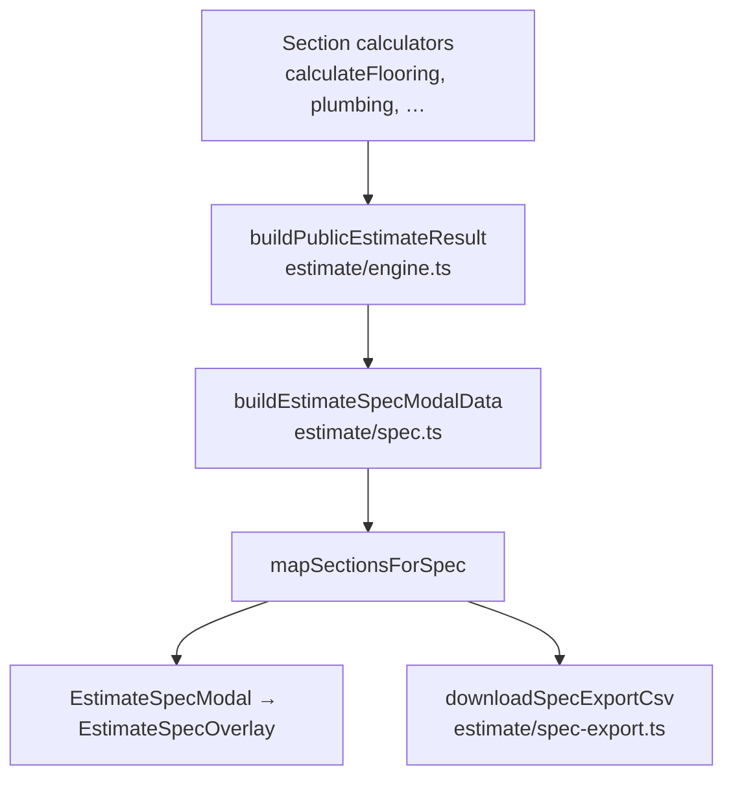

# PF6 — Публичный документ сметы, PDF и снятие CSV с public UI

**Дата:** 2026-06-05  
**Статус:** аудит + план (без реализации)  
**Связано:** `docs/package-engine-architecture-plan.md` (§4.4, §13.10–13.11, PF5/PF6), `docs/flooring-package-first-audit-plan.md` (PF6)

**Ограничения задачи:** не трогать UI/CSS (кроме явного удаления кнопки CSV в Phase A), backend, generated JSON, не реализовывать PDF.

**Уточнение путей:** в задании указаны `estimate/EstimateSpecOverlay.tsx` — фактически overlay лежит в `admin-ui/src/features/public/EstimateSpecOverlay.tsx`; modal — `admin-ui/src/features/public/components/estimate/EstimateSpecModal.tsx`.

---

## 1. Краткий аудит текущей цепочки

### 1.1 Где собирается spec



| Этап | Файл | Строки / роль |
|------|------|----------------|
| Расчёт разделов | `public-estimate-flooring.ts` | `calculateFlooring()` ~244–397: flat `section` + `buildFlooringSpecification()` + `buildFlooringProcurementSummary()` |
| Спецификация полов | `public-estimate-flooring-spec.ts` | `buildFlooringSpecification()` ~193–288, `expandFlooringSectionForSpec()` ~291–303 |
| Закупка полов | `public-estimate-flooring-procurement.ts` | `buildFlooringProcurementSummary()` |
| Сантехника spec | `public-estimate-plumbing-zones.ts` | `expandPlumbingSectionForSpec()` ~988+, тип `EstimateSpecSection` ~823–825 |
| Агрегация сметы | `estimate/engine.ts` | `buildPublicEstimateResult()` ~22–55 |
| Данные модалки | `estimate/spec.ts` | `mapSectionsForSpec()` ~53–72, `buildEstimateSpecModalData()` ~74–113 |
| Хук UI | `estimate/useEstimateSpecModal.ts` | ~7–48 |
| Оболочка | `PublicEstimate.tsx` | ~294–300, ~594 — `useEstimateSpecModal` + `<EstimateSpecModal>` |

**Полы:** `mapSectionsForSpec` подменяет `section.items` на `specificationSection.items`, но **не пересчитывает** `section.totals` (`expandFlooringSectionForSpec` копирует flat-итоги, см. ~299–302 в `public-estimate-flooring-spec.ts`). Тесты фиксируют расхождение line-sum vs `section.totals` (`calculateSpecificationSectionItemTotals`, `public-estimate-flooring-spec.test.ts`).

**Сантехника:** атомарное развёртывание зон/пакетов в `expandPlumbingSectionForSpec`; опционально `specIntro` (disclaimer зоны).

### 1.2 Где кнопка CSV

Единственная точка в **публичном UI**:

| Файл | Строки | Что делать |
|------|--------|------------|
| `admin-ui/src/features/public/EstimateSpecOverlay.tsx` | **3** — import `buildSpecExportFilename`, `downloadSpecExportCsv` | Удалить import |
| | **94–96** — `handleExportCsv` | Удалить callback |
| | **183–186** — кнопка «Скачать CSV» | Удалить кнопку |

Цепочка: `handleExportCsv` → `downloadSpecExportCsv(sections, buildSpecExportFilename(title), procurementLines)` (`spec-export.ts` ~181–195).

**Не путать с «PDF»:** `EstimatePassportSidebar.tsx` ~103–105 — «Скачать PDF сметы» вызывает `window.print()` через `useEstimatePrintActions.ts` (~4–6), это **не** PDF-движок PF6.

### 1.3 Можно ли убрать кнопку, не удаляя `spec-export.ts`

**Да.** Модуль остаётся для:

- `admin-ui/src/features/public/estimate/spec-export.test.ts` — `buildSpecExportCsv`, `buildSpecExportCsvWithProcurement`, …
- `admin-ui/src/features/public/public-flooring-package-first-e2e.test.ts` — ~12, ~157: программный CSV parity
- будущий dev/internal export или renderer после PF5

Удалять из public path нужно только **DOM + import + handler** в `EstimateSpecOverlay.tsx`.

### 1.4 Использование CSV вне public modal

| Место | Назначение |
|-------|------------|
| `estimate/spec-export.ts` | Библиотека CSV (не UI) |
| `estimate/spec-export.test.ts` | Unit-тесты |
| `public-flooring-package-first-e2e.test.ts` | E2E parity calc → expanded section → CSV |
| `docs/package-engine-architecture-plan.md` | Архитектура |
| `docs/flooring-package-first-audit-plan.md` | PF6 / test plan |

`downloadSpecExportCsv` **нигде больше не вызывается**, кроме overlay.

### 1.5 Доступные данные `EstimateSection` / `EstimateLineItem`

`public-estimate-model.ts` ~18–49:

- **Line:** `id`, `sectionId`, `title`, `category` (`works` \| `materials` \| `equipment` \| `consumables`), `quantity`, `unit`, `unitPrice`, `total`, `isIncluded`, `note?`
- **Section:** `id`, `title`, `description?`, `items[]`, `totals` (по категориям + `total`)

Дополнительно для модалки: `EstimateSpecSection` = `EstimateSection` + `specIntro?` (`public-estimate-plumbing-zones.ts` ~823–825).

**Метаданные объекта** (не в spec): `EstimateObjectMeta` — `address`, `complexName`, `apartmentNumber`, `contact` (`estimate/context.ts` ~30–35), ввод в `ObjectSection.tsx`.

**Логотип:** статика `/brand/danko-logo-mark.png` (`PublicEstimate.tsx` ~307, `PublicHeader.tsx`).

### 1.6 Где теряется структура (section / room / package / …)

| Уровень | Сейчас | Потеря |
|---------|--------|--------|
| Раздел | `section.id`, `title` | OK в модалке при `grouped` |
| Помещение | Только в `title` (`— Комната`) и `FlooringSpecificationLine.roomName` | Нет группировки по room |
| Пакет (covering/preparation/layout) | `note` = `sourceLabel` («Покрытие: …») | Нет `packageCode` / группы в UI |
| work / material / consumables | `category` на строке | Нет подзаголовков «Работы / Материалы» |
| Procurement | `FlooringProcurementLine[]` | **Не в модалке**; только в CSV (~133–165 `spec-export.ts`) |
| `specificationLines` | Параллельный массив в `FlooringCalculationResult` | Не проходит в `EstimateSpecModalData` напрямую — только через развёрнутые items |

**V12:** итог в футере модалки = `section.totals` (flat), строки могут быть specLines (`EstimateSpecOverlay.tsx` ~92, ~153, ~189).

**V13:** procurement — отдельная ветка CSV, не часть document (`package-engine-architecture-plan.md` ~624).

### 1.7 Можно ли client-facing документ без backend

**Частично да, сейчас:**

- Все суммы и строки — из frontend snapshot + calculators (уже так).
- Logo, контакты, адрес — из UI state + static assets.
- Номер сметы / дата — **нет полей**; можно генерировать на клиенте (дата = today, номер = hash/session — продуктовое решение).

**После PF5 желательно:** единый `buildPublicEstimateDocument()` на клиенте; backend не обязателен для PDF v1, если snapshot уже package-first.

**Не без PF5:** parity «итог калькулятора = итог документа = модалка» при package-only полах (сейчас totals = flat `calculateFlooring`, spec — specLines).

---

## 2. Данные для PDF (позже)

| Блок | Источник сегодня | Пробел |
|------|------------------|--------|
| Logo | `/brand/danko-logo-mark.png` | OK |
| Дата | — | Добавить в document meta |
| Номер / заголовок сметы | — | Сгенерировать или из `objectMeta` |
| Заголовок объекта | `complexName`, `address`, `apartmentNumber` | OK в meta |
| Разделы + итоги по разделу | `EstimateSection` / document sections | Нужен document builder |
| Разбивка works / materials / consumables | `totals` по категориям | Пересчёт из document lines |
| Строки позиций | `items` / document lines | Нужны группы room/package |
| Disclaimer | plumbing `specIntro` | Обобщить в document.appendix |
| Контакты | `objectMeta.contact` | OK; бренд — из константы/конфига |
| Procurement appendix | `procurementLines` | Включить в document, не только CSV |
| Grand total | `PublicEstimateResult.totals` | Синхронизировать с document |

---

## 3. Предлагаемая архитектура

### 3.1 `PublicEstimateDocument` (целевой контракт)

Согласовать с `docs/package-engine-architecture-plan.md` §4.4 (~133–159):

```ts
type PublicEstimateDocument = {
  meta: {
    generatedAt: string;       // ISO date
    title: string;              // «Смета» / «Полная спецификация»
    estimateId?: string;
    object?: EstimateObjectMeta;
    brand?: { logoUrl: string; name: string; subtitle?: string };
  };
  sections: EstimateDocumentSection[];
  appendices?: {
    procurement?: FlooringProcurementLine[];  // flooring; позже generic
    disclaimers?: string[];
  };
  totals: EstimateDocumentTotals;
};
```

**Группировка для полов** (внутри `EstimateDocumentSection`):

- `groups[]` с `scopeLabel` = room name
- `selectedPackages[]` с `packageCode`, `title`, `targetKind` (`covering` \| `preparation` \| `layout`)
- `lines[]` из `FlooringPackageSpecLine` / `FlooringSpecificationLine`
- `procurementLines` с теми же `aggregationKey`, что в `buildFlooringProcurementSummary`

### 3.2 Renderers (один источник)

| Renderer | Вход | Фаза |
|----------|------|------|
| Modal | `PublicEstimateDocument` → view-model | Phase C |
| PDF | тот же document | Phase D |
| CSV | `documentToSpecExportRows()` → существующие `buildSpecExportCsv*` | dev/test only |

`estimate/spec.ts` → тонкий адаптер: `buildPublicEstimateDocument()` + `documentToModalData()`.

### 3.3 CSV

- **Public UI:** убрать (Phase A).
- **Код:** оставить `spec-export.ts`; опционально `@internal` / комментарий «dev parity only».
- **Тесты:** parity document ↔ CSV rows (Phase E).

### 3.4 Plumbing / прочие разделы

- Plumbing: маппинг `expandPlumbingSectionForSpec` → `EstimateDocumentGroup` (zone = scope).
- Walls/electric/…: плоский список lines до PE8; без отдельной ветки CSV.

---

## 4. Фазы внедрения (малые PR)

### Phase A — убрать CSV из public UI

| Действие | Файл |
|----------|------|
| Удалить import spec-export | `EstimateSpecOverlay.tsx` ~3 |
| Удалить `handleExportCsv` | ~94–96 |
| Удалить кнопку «Скачать CSV» | ~183–186 |

**Тесты:** без изменений (overlay не покрыт отдельно). Smoke: модалка открывается, итог на месте.

**Вне scope:** rename «Скачать PDF сметы» / print CSS.

### Phase B — `buildPublicEstimateDocument()`

| Новое / изменение | Описание |
|-------------------|----------|
| `estimate/public-estimate-document.ts` (имя по конвенции) | Builder из `PublicEstimateResult` + section hooks |
| Flooring adapter | `specificationLines`, `procurementLines`, roomResults, catalog codes |
| Plumbing adapter | zones → groups |
| Totals | `sum(document.lines)`; policy округления |

Зависимость: **лучше после / вместе с PF5** (убрать flat fallback в spec).

### Phase C — модалка читает document

| Файл | Изменение |
|------|-----------|
| `estimate/spec.ts` | `buildEstimateSpecModalData` → document → sections view |
| `EstimateSpecOverlay.tsx` | Props: document или typed sections + optional procurement block в body |
| `EstimateSpecModal.tsx` | Прокидывание |

Показать procurement в UI (сейчас только CSV) — продуктовое решение Phase C.

### Phase D — PDF renderer (план, без кода)

**Библиотеки (кандидаты):**

| Lib | Плюсы | Минусы |
|-----|-------|--------|
| **pdfmake** | Декларативная разметка, таблицы, кириллица с fonts | Bundle size, embed fonts |
| **@react-pdf/renderer** | React-компоненты | SSR/шрифты, сложнее в Vite |
| **jspdf + jspdf-autotable** | Простой imperative | Верстка руками |

**Рекомендация для v1:** pdfmake + embedded Roboto/PT Sans; один `renderEstimatePdf(document): Blob`.

**Макет (скетч):**

1. Шапка: logo, «Смета», дата, объект, контакт  
2. По разделам: заголовок, итог раздела  
3. По группам (room): подзаголовок  
4. Таблица: позиция \| кат. \| кол-во \| ед. \| цена \| сумма  
5. Итоги: works / materials / consumables  
6. Appendix: procurement (если flooring)  
7. Footer: disclaimer + контакты Danko  

Точка входа: кнопка sidebar вместо/рядом с `window.print()` — отдельный PR после document stable.

### Phase E — parity tests

| Тест | Проверка |
|------|----------|
| `public-estimate-document.test.ts` | document totals = `calculateFlooring().total` (golden fixture) |
| Обновить e2e | `buildSpecExportCsv(documentToSections(doc))` |
| Modal view-model | line count / grand total = document.totals |
| PDF snapshot (опционально) | hash blob или smoke «generates non-empty» |

### Что НЕ ломать

- **`calculateFlooring()`** формулы flat buckets (~173–366) — source of truth для **калькулятора** до PF5 flip.
- **`computeFlooringSpecLineRawQuantity()`** — shared с procurement (~96–117 `public-estimate-flooring-spec.ts`).
- **`buildFlooringProcurementSummary()`** aggregation keys.
- Snapshot validators / `generate-snapshot` — вне PF6.
- Plumbing `expandPlumbingSectionForSpec` поведение A8.2.

---

## 5. Риски и открытые вопросы

| # | Риск | Митигация |
|---|------|-----------|
| R1 | Удаление CSV без PF5 — пользователи теряют export | Phase A OK; PDF позже; временно print |
| R2 | V12: модалка показывает flat total при spec lines | PF5 + пересчёт totals в document |
| R3 | Procurement только в CSV сегодня | Решить: показывать в модалке/PDF appendix |
| R4 | «Скачать PDF» = print — ожидания пользователей | Copy/label в отдельном UX PR |
| R5 | PF6 до PF5 — двойная миграция | Порядок: PF5 → PF6 (plan §17) |
| R6 | Кириллица в PDF fonts | Embed fonts в pdfmake |
| R7 | Нет estimate number | Продукт: session id vs sequential |

**Открытые вопросы:**

1. Показывать ли procurement в модалке после Phase A?  
2. Заменять ли `window.print()` на real PDF в sidebar?  
3. Единая политика округления (2 знака) для calc / document / export?  
4. Нужен ли CSV в admin CRM (вне scope public)?  
5. Scope PF6 только flooring+plumbing или все разделы в document v1?

---

## 6. Executive summary

Публичная спецификация строится в **`buildEstimateSpecModalData`** (`estimate/spec.ts`), с разворотом полов (`expandFlooringSectionForSpec`) и сантехники. **CSV — единственная кнопка в `EstimateSpecOverlay.tsx` (183–186)**; модуль **`spec-export.ts` можно сохранить** для тестов. Единого **`PublicEstimateDocument` нет** — модалка, flat totals и procurement расходятся (V12, V13). **Настоящего PDF нет** — «Скачать PDF» = `window.print()`.

### Top actions

1. **Phase A:** удалить CSV UI в `EstimateSpecOverlay.tsx` (~3, 94–96, 183–186).  
2. **PF5:** `buildPublicEstimateDocument()` + убрать flat/spec drift для полов.  
3. **Phase C:** модалка = renderer document (+ решение по procurement в UI).  
4. **Phase D:** pdfmake + макет шапка/разделы/appendix.  
5. **Phase E:** golden parity calc ↔ document ↔ CSV (dev) ↔ PDF totals.
