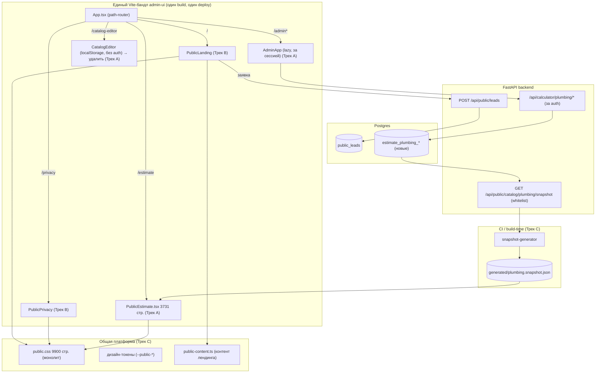
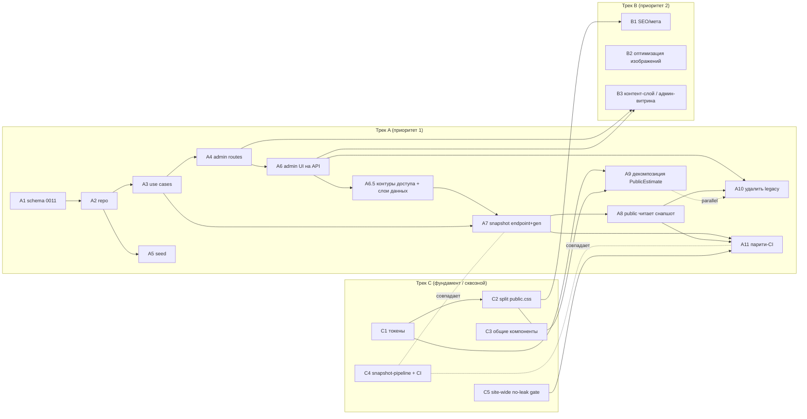
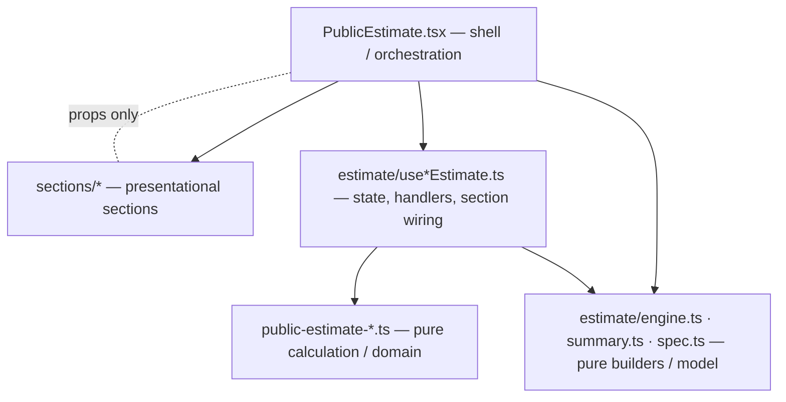
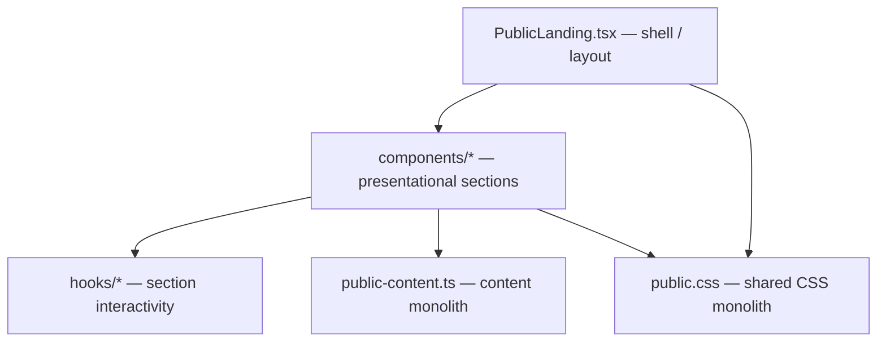
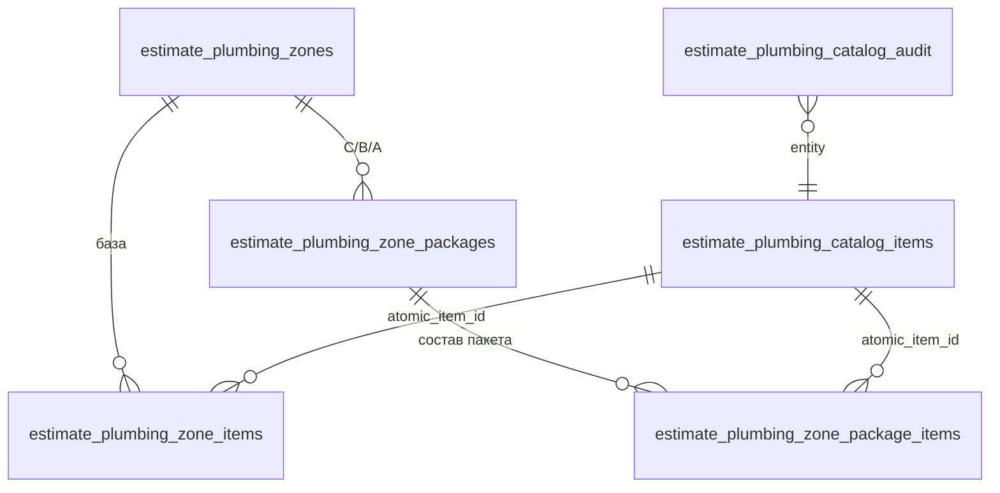
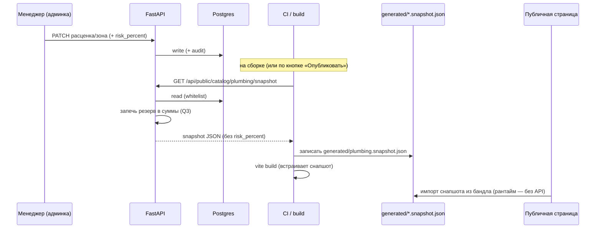

# Архитектурный план публичного сайта Danko → «10/10»

Дата: 2026-05-29 · Ветка: `local-catalog-editor` (отребейзена на свежий `main`).

Статус документа: **план (согласован)**. Продуктовый код не меняется. Это карта работ перед реализацией всего публичного сайта: **лендинг + калькулятор + админка**.

> **Расширение scope.** Прошлая версия документа (`public-calculator-architecture-plan.md`) описывала только калькулятор. Теперь scope — вся публичная поверхность сайта. Документ переименован и разбит на параллельные **треки A/B/C**, развилки Q1–Q6 переведены из «открытых» в «ПРИНЯТЫЕ РЕШЕНИЯ», а все этапы переформатированы в формат **«этап → подшаги → gate-проверка»** с явными точками отката.

---

## Оглавление

- [Раздел 0. Карта публичного сайта](#раздел-0-карта-публичного-сайта)
- [Раздел 1. Принятые решения (закреплено)](#раздел-1-принятые-решения-закреплено)
- [Раздел 2. Принцип внедрения (обязательный)](#раздел-2-принцип-внедрения-обязательный)
- [Раздел 3. Треки A / B / C — обзор, приоритеты, зависимости](#раздел-3-треки-a--b--c--обзор-приоритеты-зависимости)
- [Раздел 4. Трек A — Калькулятор + БД + Админка](#раздел-4-трек-a--калькулятор--бд--админка)
  - [4.A.debt. Зафиксированные долги A8/A9 (не чинить в A9)](#4adebt-зафиксированные-долги-a8a9-не-чинить-в-a9)
- [Раздел 5. Трек B — Лендинг](#раздел-5-трек-b--лендинг)
- [Раздел 6. Трек C — Общая платформа публичного сайта](#раздел-6-трек-c--общая-платформа-публичного-сайта)
- [Раздел 7. Безопасность (сводно)](#раздел-7-безопасность-сводно)
- [Раздел 8. Стратегия тестирования](#раздел-8-стратегия-тестирования)
- [Раздел 9. Риски и откаты](#раздел-9-риски-и-откаты)
- [Раздел 10. Чек-лист «10/10» (весь сайт)](#раздел-10-чек-лист-1010-весь-сайт)
- [Раздел 11. Развилки Q7–Q10 (ПРИНЯТЫЕ РЕШЕНИЯ)](#раздел-11-развилки-q7q10-принятые-решения)
- [Приложение A. История развилок Q1–Q6](#приложение-a-история-развилок-q1q6)
- [Приложение B. Справочник: модель данных, API, снапшот (Трек A)](#приложение-b-справочник-модель-данных-api-снапшот-трек-a)
- [Приложение C. История развилок Q7–Q10](#приложение-c-история-развилок-q7q10)

---

## Раздел 0. Карта публичного сайта

### 0.1. Публичные поверхности

Весь публичный сайт собирается в **один Vite-бандл** `admin-ui` и маршрутизируется path-роутером `admin-ui/src/App.tsx` (без react-router — ручной разбор `window.location.pathname`):

| URL | Компонент | Назначение | Доступ | Загрузка |
|---|---|---|---|---|
| `/` | `PublicLanding` (`features/public/PublicLanding.tsx`) | Маркетинговый лендинг | публичный | eager |
| `/privacy` | `PublicPrivacy` (`features/public/PublicPrivacy.tsx`) | Политика обработки ПДн | публичный | eager |
| `/estimate` | `PublicEstimate` (`features/public/PublicEstimate.tsx`) | Публичный калькулятор сметы | публичный | eager |
| `/catalog-editor` | `CatalogEditor` (`features/catalog-editor/CatalogEditor.tsx`) | Внутренний редактор каталога (localStorage, **без auth**) | сейчас открыт всем | lazy |
| `/admin*` | `AdminApp` | Админка | за сессией | lazy |

> Ссылки на код: `admin-ui/src/App.tsx:33-61` (роутинг), `admin-ui/src/App.tsx:7-9` (комментарий «редактор не для прода»).

### 0.2. Что общего у всех публичных поверхностей

- **Единый деплой/сборка.** Один `vite build` на `admin-ui`; лендинг, privacy, калькулятор, редактор и админка — в одном артефакте.
- **Единый CSS-монолит.** `admin-ui/src/features/public/public.css` — **9900 строк**, обслуживает лендинг + privacy + калькулятор. Дизайн-токены (`--public-green`, `--public-green-deep`, `--public-ink`, `--public-muted`, `--public-border`, `--public-motion-smooth`) объявлены инлайн на селекторе `.public-landing` (`public.css:2-16`), а не в отдельном tokens-файле. Калькулятор переиспользует их, рендерясь внутри `.public-landing`-контекста (селекторы `.public-estimate*` встречаются 127 раз).
- **Единая точка входа/SEO.** `admin-ui/index.html` — один `<head>` на все маршруты (SPA, без per-route мета).
- **Единый backend-контур.** Публичная связь с backend сейчас одна: `POST /api/public/leads` (форма заявки). Реализация: `src/supply_bot/admin_api/app_routes_public.py`.
- **Общий бренд-слой.** Логотип `/brand/danko-logo-mark.png`, шрифт Montserrat (Google Fonts CDN).

### 0.3. Что специфично

| Поверхность | Специфика |
|---|---|
| Лендинг | Контент захардкожен в `features/public/public-content.ts` (360 стр.): услуги, пакеты-витрина с точными ценами, кейсы/портфолио + изображения, шаги процесса, форма заявки. Хорошо декомпозирован на компоненты. |
| Калькулятор | God-компонент `PublicEstimate.tsx` (3731 стр.), 16 расчётных модулей `public-estimate-*.ts`, hardcode-ставки, дубль источника правды по сантехнике. |
| Админка | За `require_admin_session`; редактор каталога сейчас НЕ здесь (он в публичном `/catalog-editor` без auth — долг). |

### 0.4. Mermaid: карта всего публичного сайта



---

## Раздел 1. Принятые решения (закреплено)

Эти решения согласованы пользователем и являются **обязательными вводными** для всей реализации. Развилки Q1–Q6 закрыты (история — в [Приложении A](#приложение-a-история-развилок-q1q6)).

| # | Решение | Что это значит на практике |
|---|---|---|
| **Q1 — источник публичных данных** | **Build-time snapshot JSON** (НЕ рантайм-API). | Публичные данные калькулятора собираются в `generated/*.snapshot.json` на сборке/CI и встраиваются в бандл. Браузер не дёргает API ради расценок. Сохраняется дизайн «frontend-only». Рантайм-endpoint существует только как источник для генератора и для возможного будущего «горячего» обновления. |
| **Q2 — где управление каталогом** | **Внутри `AdminApp` за сессией.** | `CatalogEditor` переезжает из публичного роута `/catalog-editor` в админ-навигацию под `require_admin_session`. Публичный роут удаляется. |
| **Q3 — резерв `risk_percent`** | **Запекается в итоговые суммы; процент НЕ публикуется.** | Резерв 6.4% (`DEFAULT_ZONE_RISK_PERCENT`) хранится в БД и виден в админке. В **публичный snapshot уходит только итог** (цена/сумма зоны уже с резервом). Поле `riskPercent` из публичного JSON **исключается** (whitelist его не пропускает). См. механику в [§1.1](#11-механика-запекания-резерва-q3). |
| **Q4 — объём первого этапа** | **Первый этап — только сантехника.** | В БД заводим только `estimate_plumbing_*`. Схема проектируется расширяемой (owner-scoping, `is_active`, единая форма таблиц зон/атомов) под будущие секции: полы, двери, стены, потолки, электрика, тёплый пол и т.д. |
| **Q5 — пространство API** | **`/api/calculator/plumbing/*`.** | Единообразие с существующими ceilings/doors. Публичный read-endpoint — `/api/public/catalog/plumbing/snapshot`. |
| **Q6 — глубина декомпозиции** | **Серия мелких подшагов** (не один большой PR). | Декомпозиция `PublicEstimate.tsx` дробится по группам секций — см. этап A9. |

### 1.1. Механика запекания резерва (Q3)

Резерв — внутренний параметр и **не должен попадать в публичный слой даже как процент**. Поэтому:

1. **В БД:** `estimate_plumbing_zones.risk_percent` (default `6.4`) хранится и редактируется в админке.
2. **На backend при сборке снапшота:** итоговая цена зоны/пакета вычисляется уже **с учётом резерва**:
   `zone_total_public = round( Σ(atom_unit_price × qty × coef) × (1 + risk_percent/100) )`.
3. **В публичный snapshot** попадает только результат (готовая сумма/цена), **без** поля `riskPercent` и без разбивки.
4. **Whitelist-тест** падает, если в публичном JSON обнаружено `risk_percent`/`riskPercent` или любая разбивка себестоимости.
5. **Клиентский расчёт** перестаёт самостоятельно прибавлять резерв — он получает уже «запечённые» суммы. Это меняет текущую клиентскую формулу (сейчас процент применяется на клиенте) → учтено в этапе A8 как отдельный подшаг с парити-проверкой.

> Граница public/internal (полная таблица полей) — в [Приложении B, §B.3](#b3-граница-данных-public-vs-internal).

---

## Раздел 2. Принцип внедрения (обязательный)

Закрепляется как **жёсткое правило** для всех треков и этапов:

1. **Каждый этап делится на подшаги.** Формат подшага:
   - `Шаг N.M — <действие>`
   - **Файлы/изменения:** что именно трогаем.
   - **Проверка (gate):** что запустить/посмотреть (`npm run build`, `npm test`/`vitest`, `pytest`, открыть URL на dev).
   - **Критерий прохождения:** измеримое условие «зелёного».
   - **Откат:** как вернуться (revert коммита / бэкап-ветка).
2. **Строго линейный порядок внутри трека.** Следующий подшаг начинается только после зелёного gate предыдущего.
3. **Обратимость каждого подшага.** Перед крупным этапом — бэкап-ветка `backup/pre-<этап>`; коммиты атомарные (один подшаг ≈ один коммит).
4. **Проверка после каждого шага = build + test + визуальный просмотр на dev.** Минимум: `npm run build` (admin-ui) зелёный; релевантные тесты зелёные; ручной просмотр затронутого URL на dev-сервере.
5. **Явные межтрековые зависимости** (см. [§3.3](#33-граф-зависимостей-этапов-и-треков)).
6. **Definition of Done на уровне этапа** — отдельным блоком в конце каждого этапа.
7. **Точки безопасной остановки/коммита** помечены `Можно остановиться:` — на них репозиторий в консистентном состоянии.
8. **Порядок внедрения — от меньшей зоны риска к большей** (закреплено 2026-05-29, пользователь одобрил план целиком). Сначала идут аддитивные/обратимые шаги, ничего не ломающие в продовом коде (схема БД, низкорисковые C1/C2, быстрые победы B1/B2), и только затем — изменения, затрагивающие публичный расчёт и зачистку legacy. Конкретный укрупнённый порядок — в [§3.2](#32-последовательность-и-параллелизм) и [§3.3](#33-граф-зависимостей-этапов-и-треков).

> Базовый «gate-набор» команд (выполняется в `admin-ui/` для фронта, в корне — для backend):
> - Frontend build: `npm run build`
> - Frontend tests: `npm run test` (vitest)
> - Backend tests: `pytest tests/...`
> - Dev-просмотр: `npm run dev` → открыть затронутый URL (`/`, `/privacy`, `/estimate`, `/catalog-editor`, `/admin`).

---

## Раздел 3. Треки A / B / C — обзор, приоритеты, зависимости

### 3.1. Назначение треков

| Трек | Название | Приоритет | Кратко |
|---|---|:--:|---|
| **A** | Калькулятор + БД + Админка | **1** | БД сантехники, API, перенос редактора в админку за auth, build-time снапшот, декомпозиция `PublicEstimate.tsx` (3731 стр.), удаление дублей источника правды. |
| **B** | Лендинг | **2** | SEO/мета-фундамент, оптимизация изображений, контент-слой и (опционально) управляемая из админки витрина/портфолио. Лендинг уже декомпозирован на компоненты — упор на SEO/перф/контент, а не на разрезание монолита TSX. |
| **C** | Общая платформа публичного сайта | **сквозной** | Дизайн-токены, разрезание `public.css` (9900 стр.), общие компоненты, единый деплой-pipeline + snapshot-механизм, сайтовая защита от утечки internal, CI-парити. |

### 3.2. Последовательность и параллелизм

- **Трек A — первый и главный.** Внутри трека этапы строго линейны (схема в [Приложении B](#приложение-b-справочник-модель-данных-api-снапшот-трек-a)), но фронтовая декомпозиция (A9) идёт параллельно backend-этапам A1–A7.
- **Трек C — фундамент, дробится и подкладывается под A и B.** Безопасные низкорисковые шаги (токены C1, split CSS C2) лучше сделать **рано**, т.к. от них зависят и калькулятор, и лендинг. Snapshot-инфраструктура (C4) технически совпадает с этапами A7/A11 — описана как общий механизм.
- **Трек B — после/параллельно** базовым шагам C. SEO (B1) и оптимизация картинок (B2) ни от чего не зависят и могут идти в любой момент (быстрые победы). Управляемая витрина (B3) зависит от admin-инфраструктуры трека A (A4/A6) и решений Q7/Q8.

### 3.3. Граф зависимостей этапов и треков



**Рекомендуемый порядок исполнения (укрупнённо):**
1. **C1 → C2** (токены + split CSS, низкий риск, разблокирует всех).
2. **A1 → A2 → A3 → A4 → A5** (backend сантехники).
3. Параллельно с A1–A5: **A9** (декомпозиция фронта) и **B1/B2** (SEO/картинки — быстрые победы).
4. **A6 → A7 → A8** (админ-UI, снапшот, публичный расчёт на снапшоте; C4 = инфраструктура A7).
5. **A10 → A11** (зачистка legacy + парити-CI; C5 = сайтовый no-leak gate).
6. **B3** (управляемая витрина/портфолио) — после A4/A6 и решений Q7/Q8.

---

## Раздел 4. Трек A — Калькулятор + БД + Админка

### 4.A.0. As-is (аудит калькулятора)

Замеры по файлам (строки), `admin-ui/src/features/public/`:

| Файл | Строк | Роль | Проблема |
|---|---:|---|---|
| `public.css` | **9900** | Общий CSS (лендинг+калькулятор) | См. Трек C — крупнейший монолит сайта |
| `PublicEstimate.tsx` | **3731** | God-компонент калькулятора | ~30 `useState`, ~20 `update*`-хендлеров, 14+ `<section>`, spec-overlay, печать, lead-форма |
| `public-estimate-plumbing-zones.ts` | 702 | Зоны сантехники (база/пакеты/spec) | Зональная логика только у сантехники |
| `public-estimate-plumbing.ts` | 576 | Расчёт сантехники | **Дубль источника правды**: hardcode `plumbingRates` |
| `public-estimate-flooring.ts` | 390 | Расчёт полов | Hardcode-ставки |
| `public-estimate-electric.ts` | 342 | Расчёт электрики | Hardcode-ставки |
| `public-estimate-warm-floor.ts` | 291 | Тёплый пол | Hardcode-ставки |
| `public-estimate-walls.ts` | 264 | Стены | Hardcode-ставки |
| `public-estimate-ceiling.ts` | 260 | Потолки | Hardcode-ставки |
| `public-estimate-{doors,completion,appliances,loose-furniture,home-goods,package,model,input,geometry}.ts` | 68–201 | Расчёт секций / модель | Hardcode-ставки в каждой |
| `catalog-editor/CatalogEditor.tsx` | 1434 | Редактор каталога | `localStorage`, без auth, не влияет на публичную цену |
| `catalog-editor/plumbing-seed.ts` | 625 | `PLUMBING_SEED` + `ZONES_SEED` | Источник правды компайл-тайм, дублируется в `plumbingRates` |

**Реестр долгов калькулятора:**

| # | Долг | Где | Последствие |
|---|---|---|---|
| D1 | Два источника правды по сантехнике | `plumbingRates` vs `PLUMBING_SEED` | Рассинхрон цен |
| D2 | Источник правды в коде, не в БД | `plumbing-seed.ts` | Цены меняются только релизом фронта |
| D3 | Редактор не влияет на публичную цену | `CatalogEditor` ↔ `localStorage` | Иллюзия управления |
| D4 | Нет auth у редактора | `/catalog-editor` в публичном бандле | Любой посетитель открывает внутренний инструмент |
| D5 | God-компонент | `PublicEstimate.tsx` 3731 стр. | Дорогая поддержка |
| D6 | Зональная модель только у сантехники | прочие секции — плоский hardcode | Нет единого паттерна |
| D7 | Нет БД для сантехники | gap-map: `plumbing` missing | Нет управления/версионирования/аудита |
| D8 | Internal-поля в одной модели с публичными | `CatalogItem` | Риск утечки |
| D9 | Нет аудита изменений расценок | — | «Кто/когда менял цену» неизвестно |

### 4.A.tobe. To-be (целевая архитектура)

- **Единый источник правды — Postgres.** Любая расценка/зона/пакет — в БД в одном экземпляре. Фронт получает производную (снапшот).
- **Публичный слой — frontend-only в рантайме** (Q1): браузер читает встроенный снапшот.
- **Граница public/internal — на уровне DTO/whitelist.** Резерв запекается (Q3).
- **Один паттерн секций** (Q4): сантехника — эталон, остальные секции переезжают по тому же шаблону.
- **Управление — в админке за сессией** (Q2).

Модель данных, API-контракты и схема снапшота вынесены в [Приложение B](#приложение-b-справочник-модель-данных-api-снапшот-трек-a) (без изменений по существу относительно согласованной версии, с учётом Q3).

### 4.A.steps. Этапы трека A (этап → подшаги → gate)

> Перед стартом трека: создать бэкап-ветку `backup/pre-trackA` (`git branch backup/pre-trackA`).

#### Этап A1 — Schema: миграция `0011` + таблицы сантехники

Зависит от: — · Размер: M · Параллельно: A9, B1, B2

- **Шаг A1.1 — описать таблицы в `tables.py`.**
  - Файлы: `src/supply_bot/storage_estimates/tables.py` — `estimate_plumbing_catalog_items`, `estimate_plumbing_zones`, `estimate_plumbing_zone_items`, `estimate_plumbing_zone_packages`, `estimate_plumbing_zone_package_items`, `estimate_plumbing_catalog_audit` (по образцу `estimate_ceiling_catalog_items`, см. `tables.py:476`).
  - **Проверка:** `python -c "import supply_bot.storage_estimates.tables"`; `pytest tests/test_storage_estimates_schema.py -q` (если есть) или smoke-импорт.
  - **Критерий:** модуль импортируется, метаданные таблиц валидны.
  - **Откат:** revert коммита.
- **Шаг A1.2 — миграция `migrations/versions/0011_create_estimate_plumbing.py`.**
  - Файлы: новая миграция (текущий максимум — `0010`).
  - **Проверка:** прогнать миграции вверх/вниз на SQLite (dev) и на Postgres: `alembic upgrade head` + `alembic downgrade -1`.
  - **Критерий:** миграция применяется и откатывается на обоих движках; индексы (owner / owner_active / partial-unique global+owner) создаются.
  - **Откат:** `alembic downgrade -1`; revert.
- **DoD этапа A1:** таблицы + индексы + audit существуют; миграция обратима на SQLite и Postgres.
- **Можно остановиться:** да (схема без данных, ничего не использует).

#### Этап A2 — Repository + unit-тесты

Зависит от: A1 · Размер: M

- **Шаг A2.1 — `plumbing_repository.py`** (CRUD атомов/зон/пакетов, owner-scoping через `_required_owner_clause`, soft-delete `is_active=0`).
  - Файлы: `src/supply_bot/storage_estimates/plumbing_repository.py`.
  - **Проверка:** `pytest tests/test_storage_estimates_plumbing_repository.py -q`.
  - **Критерий:** CRUD + owner-изоляция + soft-delete покрыты тестами, зелёные.
  - **Откат:** revert.
- **Шаг A2.2 — аудит-запись** в `estimate_plumbing_catalog_audit` при create/update/delete.
  - **Проверка:** тест: после mutate появляется audit-строка с `changed_by_user_id` и `diff_json`.
  - **Критерий:** аудит пишется; **Откат:** revert.
- **DoD A2:** репозиторий покрыт unit-тестами (CRUD, owner, soft-delete, audit).

#### Этап A3 — Application use cases + payloads

Зависит от: A2 · Размер: M

- **Шаг A3.1 — use cases** create/update/delete (по образцу `estimates/application/ceiling_*`).
  - Файлы: `src/supply_bot/estimates/application/plumbing_*`.
  - **Проверка:** `pytest tests/test_plumbing_use_cases.py -q`.
  - **Критерий:** зелёные; **Откат:** revert.
- **Шаг A3.2 — payload-сборка снапшота** (агрегация атомов в суммы зон/пакетов **с запеканием резерва**, Q3 §1.1).
  - **Проверка:** unit-тест: для эталонной «Зоны мойки» (база + пакет B) сумма с резервом 6.4% совпадает с текущим клиентским расчётом.
  - **Критерий:** парити-эталон зелёный; **Откат:** revert.
- **DoD A3:** use cases + сборка публичных сумм (резерв запечён) готовы и покрыты.

#### Этап A4 — Admin routes + регистрация + smoke

Зависит от: A3 · Размер: M · Параллельно: A5, A7

- **Шаг A4.1 — роуты `/api/calculator/plumbing/*`** (CRUD атомов/зон, `snapshot/preview`), за `require_admin_api_session`.
  - Файлы: `src/supply_bot/admin_api/calculator_routes/plumbing.py` + регистрация в `route_registry`.
  - **Проверка:** `pytest tests/test_calculator_plumbing_routes.py -q` (200 за сессией / 401 без / 422 на плохой payload).
  - **Критерий:** smoke на каждый endpoint зелёный; **Откат:** revert.
- **DoD A4:** все admin-эндпоинты §B.2 за auth, зарегистрированы, со smoke-тестами.
- **Можно остановиться:** да.

#### Этап A5 — Data seed: `plumbing-seed.ts` → БД (идемпотентно)

Зависит от: A2 · Размер: S · Параллельно: A4, A7

- **Шаг A5.1 — идемпотентный seed** глобальных дефолтов (`owner_user_id = NULL`): upsert атомов по `source_code`, зон по `zone_code`, состав/пакеты по `atomic_item_id` (учесть `LEGACY_ATOMIC_ITEM_ID_MAP` из `CatalogEditor.tsx`).
  - Файлы: seed-скрипт + вызов в lifespan/миграции данных.
  - **Проверка:** запустить seed дважды → второй прогон без изменений; `pytest tests/test_plumbing_seed_parity.py`.
  - **Критерий:** парити-тест зон (фронт `calculateZoneTotal` == backend из БД, с резервом) зелёный; повторный seed идемпотентен.
  - **Откат:** revert; данные глобальные, перезаписываются повторным seed.
- **DoD A5:** глобальные дефолты сантехники в БД, парити зелёный.

#### Этап A6 — Admin UI каталога на API + auth-gate (перенос редактора)

Зависит от: A4 · Размер: L (дробится)

- **Шаг A6.1 — контроллер на API** (паттерн `features/calculator/app/ceilings.ts`: `fetchJson`, `setBusyKey/Error/Success`, `handleCreate/Update/Delete...`).
  - **Проверка:** `npm run build`; ручной CRUD на dev `/admin`.
  - **Критерий:** CRUD атомов работает через API; **Откат:** revert.
- **Шаг A6.2 — UI зон** (состав `atomic_item_id`+qty+coef, `risk_percent`, пакеты C/B/A) + **превью публичной цены** через `snapshot/preview`.
  - **Проверка:** dev: редактирование зоны → превью показывает публичную цену (с запечённым резервом).
  - **Критерий:** превью совпадает с ожидаемой публичной суммой; **Откат:** revert.
- **Шаг A6.3 — монтировать редактор в `AdminApp` за сессией** (lazy, под `require_admin_session`).
  - **Проверка:** dev: `/admin` → раздел каталога доступен; без сессии — редирект/401.
  - **Критерий:** редактор доступен только за сессией; **Откат:** revert.
- **DoD A6:** управление атомами/зонами/пакетами на API внутри `AdminApp`; превью цены; за auth.
- **Можно остановиться:** да (старый `/catalog-editor` ещё жив как fallback — удаляется в A10).

#### Этап A6.5 — Контуры доступа (auth-hardening) и слои данных

Зависит от: A4, A6 · Размер: M · Связан с: A7 (снапшот читает Слой 0)

> **Назначение этапа.** Зафиксировать модель доступа и разделения данных, согласованную пользователем: **два отдельных продукта с двумя отдельными контурами аутентификации** и **два непересекающихся слоя данных**. Часть подложки уже существует в коде (роль-гейт каталога и owner-scoping); этот этап формализует целевое состояние и закрывает auth-hardening явными gate-критериями. Решение по разделению cookies/контуров и по слоям данных — обязательная вводная (закреплено пользователем).

##### A6.5.0. Два контура аутентификации (НЕ одна общая регистрация)

Сайт обслуживает **два разных продукта**, у каждого — **свой контур аутентификации** (отдельные cookie/области сессий, а **не** одна общая сессия с флагами ролей):

1. **Админка (admin realm)** — внутренний инструмент для владельца и его команды.
   - Назначение: вручную вести материальную базу, редактировать расценки публичного калькулятора и заносить базу расценок для внутреннего калькулятора/CRM.
   - Это **источник правды = глобальный каталог** (`owner_user_id = NULL`), заведённый в A6.5-подложке (см. A5/A6 и `_visible_catalog_clause`).
   - Доступ **закрыт**: админ-аккаунты выдаются вручную / по приглашению. **Публичного пути саморегистрации, дающего админ-аккаунт, нет.** Роль `admin` (в будущем дробится на более узкие, напр. `catalog_editor`).
   - Эндпоинты управления каталогом (`/api/calculator/plumbing/*` и будущая материальная база) гейтятся `require_admin_role_session` (**уже реализовано**, см. `src/supply_bot/admin_api/deps.py`: 403 для не-админской валидной сессии; локальный bypass `admin_auth_enabled=False` считается админом только в dev).
2. **Внутренний калькулятор → будущая CRM (CRM/user realm)** — отдельный продукт для конечных пользователей (строителей): логистика, проекты по отделке и т.д.
   - Пользователи **могут саморегистрироваться**, но саморегистрация **всегда** даёт только роль `user` — **никогда** `admin`.
   - Пользователи потребляют глобальную базу **только на чтение** и могут добавлять **свои** сценарии/позиции как отдельный пер-пользовательский слой.

**Раздельные cookie / раздельные контуры сессий (закреплено пользователем).** Admin realm и CRM realm используют **разные** cookie/области сессий, а не одну общую сессию с флагами ролей. Это минимизирует blast radius и исключает утечку данных между продуктами. Admin-эндпоинты принимают **только** admin-cookie/контур, CRM-эндпоинты — **только** CRM-cookie/контур.

- **Уже есть:** admin-контур на cookie `supply_admin_session` (`auth.py: SESSION_COOKIE_NAME`), `AdminSession` с полями `role`/`user_id`, гейты `require_admin_session` / `require_admin_role_session`.
- **К реализации:** отдельный CRM-контур (своя cookie/имя, свой секрет/область валидации сессий); CRM-гейт, который **не** доверяет admin-cookie; и наоборот — admin-гейты **не** принимают CRM-cookie.

##### A6.5.1. Два слоя данных (пересекаются только на чтение сценариев/позиций)

- **Слой 0 — глобальная база (`owner_user_id = NULL`)**: редактируется **только** через admin realm. Питает публичный калькулятор (через build-time снапшот, A7) и базовые расценки CRM.
- **Слой 1 — пользовательские сценарии/позиции (`owner_user_id = user_id`)**: создаются в CRM, читаемый оверлей **поверх** Слоя 0; **никогда** не мутирует Слой 0.
- **Единственное разрешённое межслойное взаимодействие — чтение** сценариев и позиций: CRM-пользователь **читает** глобальные сценарии/позиции, его личный слой читается **поверх** глобального. **Записи слои не пересекают**; в остальном контуры не пересекаются вовсе.

**Подложка уже существует в репозитории — модель переделывать не нужно:**

- `for_owner(None)` = глобальный слой (Слой 0), `for_owner(user_id)` = личный слой (Слой 1) — см. `storage_scope.py` и `storage_estimates/repository.py`.
- Чтение-оверлей реализован в `_visible_catalog_clause`: при `owner_user_id IS NULL` видно только глобальное; при заданном `owner_user_id` видно `owner_user_id IS NULL` **ИЛИ** `owner_user_id = user_id` (глобальное + своё). Запись же всегда уходит на `_catalog_write_owner_value()` = текущий owner, поэтому Слой 1 физически не может перезаписать строки `owner=NULL`.
- Для CRM-сценариев с явным глобальным чтением есть `for_owner_with_global_reads(user_id)` (`storage_scope.py`).

> Итог: A6.5 — это **документирование и harden существующей подложки**, а не реворк модели данных. Новым является только разделение cookie/контуров CRM↔admin.

##### A6.5.2. Подшаги (этап → подшаг → gate)

- **Шаг A6.5.1 — закрыть путь выдачи админ-аккаунта публично.** Убедиться, что ни один публичный/CRM-роут регистрации не может выдать роль `admin`; саморегистрация жёстко проставляет `role = "user"`; админ-аккаунты заводятся только вручную/по приглашению.
  - Файлы: будущий CRM-регистрационный роут + конфигурация ролей (admin-провижининг — вне публичного контура).
  - **Проверка:** тест — POST на публичный/CRM-регистрационный эндпоинт никогда не возвращает сессию с `role == "admin"`; нет роута, минтящего админа без ручного провижининга.
  - **Критерий:** ни один публичный роут не выдаёт админ-аккаунт; **Откат:** revert.
- **Шаг A6.5.2 — развести cookie/контуры.** Ввести отдельный CRM-cookie/секрет/область сессии; admin-гейты принимают только admin-cookie, CRM-гейты — только CRM-cookie.
  - Файлы: CRM-аналог `auth.py`/`deps.py` (своя `SESSION_COOKIE_NAME`, свой секрет), регистрация гейтов.
  - **Проверка:** тест — admin-cookie не валиден на CRM-гейте и наоборот; `/api/calculator/plumbing/*` отвергает CRM-cookie (401/403).
  - **Критерий:** контуры изолированы по cookie; **Откат:** revert.
- **Шаг A6.5.3 — закрепить гейт каталога за `require_admin_role_session`.** Подтвердить (тест), что все mutating-эндпоинты материальной базы/каталога гейтятся ролью `admin`.
  - **Проверка:** `pytest` — не-админская валидная сессия → 403 на `/api/calculator/plumbing/*` (mutating); без сессии → 401.
  - **Критерий:** роль-гейт зелёный (уже реализован — фиксируем тестом); **Откат:** revert.
- **Шаг A6.5.4 — закрепить непересечение слоёв на запись.** Тестом подтвердить, что запись из CRM (`for_owner(user_id)`) создаёт строки только с `owner_user_id = user_id` и не трогает `owner=NULL`, а CRM может **читать** глобальные сценарии/позиции.
  - **Проверка:** `pytest` — запись Слоя 1 не меняет ни одной строки `owner=NULL`; чтение из CRM возвращает глобальное + своё (оверлей).
  - **Критерий:** слои не пересекаются на запись, чтение-оверлей работает; **Откат:** revert.

##### A6.5.3. Gate-критерии этапа (проверяемые)

- [ ] Ни один публичный/CRM-роут не может выдать (минтить) админ-аккаунт; саморегистрация → только `role = "user"`.
- [ ] CRM-сессия не достаёт до `/api/calculator/plumbing/*` (admin-каталог) — 401/403.
- [ ] Admin-сессия отвергается CRM-only роутами (если применимо к конкретному роуту).
- [ ] Записи Слоя 1 (`owner_user_id = user_id`) **никогда** не трогают строки `owner_user_id = NULL` (Слой 0).
- [ ] CRM **может читать** глобальные сценарии/позиции (оверлей Слой 1 поверх Слой 0).
- [ ] Mutating-эндпоинты каталога гейтятся `require_admin_role_session` (не-админ → 403, без сессии → 401).

**Что уже есть vs. что строим:**

| Аспект | Статус |
|---|---|
| Роль-гейт каталога `require_admin_role_session` | **уже реализовано** (`deps.py`) |
| Глобальный каталог `owner_user_id = NULL` (Слой 0) | **уже есть** (A5/A6, `_visible_catalog_clause`) |
| Owner-scoping `for_owner(None)` / `for_owner(user_id)` | **уже есть** (`storage_scope.py`, `repository.py`) |
| Чтение-оверлей Слоя 1 поверх Слоя 0 | **уже есть** (`for_owner_with_global_reads`, `_visible_catalog_clause`) |
| Отдельный CRM-контур (своя cookie/секрет, свой гейт) | **к реализации** |
| Жёсткая саморегистрация → `role = "user"` | **к реализации** (CRM-регистрация) |

- **DoD A6.5:** модель двух контуров и двух слоёв задокументирована и закреплена тестами; ни один публичный путь не минтит админа; cookie/контуры разведены; записи слоёв не пересекаются, чтение-оверлей работает; роль-гейт каталога зафиксирован.
- **Можно остановиться:** да (роль-гейт и owner-scoping уже работают; разведение CRM-контура — аддитивно).

#### Этап A7 — Public snapshot endpoint + генератор + встраивание (= C4)

Зависит от: A3 · Размер: M · Параллельно: A5

- **Шаг A7.1 — публичный read-endpoint** `/api/public/catalog/plumbing/snapshot` (whitelist, без `riskPercent`, без разбивки; Q3).
  - Файлы: backend + добавить путь в `PUBLIC_ADMIN_API_PATHS` (`app_factory.py:37`), rate-limit как у `/api/public/leads`.
  - **Проверка:** `pytest tests/test_public_plumbing_snapshot_whitelist.py` — JSON не содержит `technical_title`, `*_price` (разбивка), `coefficient`, `source`, `note`, `risk_percent`.
  - **Критерий:** whitelist-тест зелёный; **Откат:** revert.
- **Шаг A7.2 — генератор снапшота** `admin-ui/scripts/generate-snapshot.js` → `admin-ui/src/features/public/generated/plumbing.snapshot.json`; шаг `prebuild` в `package.json`.
  - **Проверка:** `npm run prebuild` создаёт/обновляет файл; `npm run build` зелёный со встроенным снапшотом.
  - **Критерий:** снапшот генерируется и встраивается; **Откат:** revert.
- **DoD A7:** публичный снапшот собирается на backend (резерв запечён, whitelist), генерируется на сборке, встраивается в бандл.

#### Этап A8 — Публичный расчёт читает снапшот; миграция legacy-опций в зоны; удалить `plumbingRates` (D1)

Зависит от: A7 · Размер: M

- **Шаг A8.1 — сантех-расчёт берёт суммы из снапшота** (вместо клиентского прибавления резерва — суммы уже запечены, §1.1). **(сделано)**
  - Файлы: `public-estimate-plumbing*.ts`.
  - **Проверка:** `npm run test` (`public-estimate-plumbing-zones.test.ts`, `public-estimate-packages.test.ts`); dev `/estimate` — суммы зон совпадают с прежними.
  - **Критерий:** расчёт идентичен прежнему (парити до/после); **Откат:** revert.
- **Шаг A8.2 — миграция legacy-опций сантехники в snapshot/зональную модель.** Плоские опции (`includeBathroomSet`, `includeBath`, `includeHygienicShower`, `includeElectricTowelRail`, `includeWasherOutput`, `includeWaterNode`, `includeLeakProtection`), которые после A8.1 ещё считались на клиенте через hardcode `plumbingRates`, переносятся в **зоны** ГЛОБАЛЬНОГО каталога/seed (`owner=NULL`, Слой 0), чтобы их состав и итог шли через build-time снапшот.
  - Файлы: `src/supply_bot/storage_estimates/plumbing_seed.py` (новые `SeedZone`), регенерация `admin-ui/src/features/public/generated/plumbing.snapshot.json` (prebuild), `public-estimate-plumbing*.ts`, `PublicEstimate.tsx`; backend seed-parity + public whitelist/parity тесты.
  - **Принципы переноса:** каждая legacy-опция → одна зона (или состав зоны), определённая **только** в глобальном seed (новые зоны во фронте не хардкодятся). Один whitelist-совместимый **итог на зону** (резерв 6.4 % запечён в итог по существующей конвенции §1.1, в клиентской спецификации отдельной строки резерва нет). Цены переносятся **точно** из текущих чисел `plumbingRates` (итог зоны = Σ атомов × (1 + 6.4 %), округление как `Math.round`), чтобы суммы были намеренными, а не случайными. Пакеты C/B/A — **только** там, где у опции есть реальный выбор класса оборудования; иначе зона с единым итогом без пакетов. Разбивка по категориям (Работы/Материалы/Оборудование/Расходники) в публичном UI сантехники **удаляется** (одобренное продуктовое решение): она конфликтует с whitelist-снапшотом (зона отдаёт единый итог, без разложения себестоимости).
  - **Проверка (gate):** `npm run build` (зелёный), `vitest run`; backend `pytest` (plumbing/snapshot/seed-suites), `ruff check` изменённых `.py`; парити: зона «Зоны мойки» остаётся base **24612**, C **39487**, B **43530**, A **54915**; для каждой новой зоны зафиксировать вычисленный итог; разбивка по категориям в UI сантехники отсутствует.
  - **Критерий:** legacy-опции считаются из снапшота через зоны; парити зоны мойки не изменилось; итоги новых зон детерминированы и задокументированы; нет разбивки по категориям; **Откат:** revert (snapshot/seed/UI — отдельными атомарными коммитами).
- **Шаг A8.3 — удалить `plumbingRates`** (старый источник правды) и legacy-ветку `calculatePlumbing` на плоских опциях, как только от них ничего не зависит.
  - Файлы: `public-estimate-plumbing.ts` (удаление `plumbingRates`, `PlumbingRate`, `PlumbingRateKey`, `plumbingRateTotal`, `addRateLines`/`addPlumbingPosition` и плоских веток).
  - **Проверка:** `npm run build` + `vitest run` зелёные; grep подтверждает отсутствие `plumbingRates` в публичном пути; парити «Зоны мойки» не изменилось.
  - **Критерий:** дубль источника правды удалён, расчёт не изменился; **Откат:** revert.
  - **Примечание:** ретирмент фронтового `catalog-editor/plumbing-seed.ts` остаётся в A10.2 (здесь не трогаем).
- **DoD A8:** сантех-расчёт полностью на снапшоте (включая мигрированные legacy-опции как зоны глобального seed); разбивки по категориям в публичном UI сантехники нет; `plumbingRates` и legacy-ветка `calculatePlumbing` удалены; цены идентичны намеренным (парити зоны мойки неизменно).

#### Этап A9 — Декомпозиция `PublicEstimate.tsx` (реестр секций + engine)

**Статус: закрыт (as-built).** Подшаги A9.1–A9.6 и серия A9.7e–A9.7q-b выполнены; этап A9.8 зафиксировал целевую архитектуру и лёгкие architecture-guards в vitest. Дальнейшая декомпозиция JSX — не в scope A9 (см. A10, C2, DEBT-* в [§4.A.debt](#4adebt-зафиксированные-долги-a8a9-не-чинить-в-a9)).

Зависит от: C1, C2 (желательно) · Размер: L (дробится) · Параллельно: A1–A7

> Дробится на подшаги по группам секций. Каждый подшаг = отдельный коммит, gate после каждого.

- **Шаг A9.1 — каркас:** `estimate/engine.ts` (pure), `estimate/context.ts`, `sections/registry.ts`, типы `SectionDescriptor`.
  - **Проверка:** `npm run test` (calc-тесты); `npm run build`.
  - **Критерий:** ядро компилируется, тесты зелёные; **Откат:** revert.
- **Шаг A9.2 — вынести геометрию** в `sections/geometry/`.
  - **Проверка:** `/estimate` геометрия работает; тесты; **Критерий:** идентичный результат; **Откат:** revert.
- **Шаг A9.3 — вынести сантехнику** (`sections/plumbing/`, calc из `public-estimate-plumbing*.ts`).
- **Шаг A9.4 — полы/стены/потолки/электрика/тёплый пол.**
- **Шаг A9.5 — двери/завершение/техника/мебель/товары.**
- **Шаг A9.6 — общие компоненты** (`ZoneCard`, `PackagePicker`, `SpecOverlay`, `NumberField`/`TextField`).
- **Шаг A9.7 — ужать шелл** `PublicEstimate.tsx` до layout + wiring секций (серия A9.7e–A9.7q-b).
  - **Проверка (после каждого A9.x):** `npm run build` + `npm run test` + dev `/estimate` визуально.
  - **Критерий:** на каждом подшаге расчёты и UI идентичны; **Откат:** revert конкретного подшага (атомарность).
- **Шаг A9.8 — as-built документация + architecture guards** (только docs + `public-estimate-architecture.test.ts`, без изменения поведения).
  - **Проверка:** `npm run test` + `npm run build`.
  - **Критерий:** guards зелёные; правила слоёв задокументированы ниже; **Откат:** revert.

##### A9.as-built. Слои `/estimate` (зафиксировано)



| Слой | Путь | Ответственность |
|---|---|---|
| Shell | `PublicEstimate.tsx` | Компоновка страницы, навигация, вызов хуков, прокидывание props в секции, сборка итога через `engine`/`summary` |
| Секции UI | `sections/*` | Разметка и отображение одной зоны сметы (без локального `useState` и без `calculate*`) |
| Контроллеры секций | `estimate/use*Estimate.ts` | `useState`/handlers секции, вызов `calculate*` из `public-estimate-*.ts`, подготовка props |
| Домен расчёта | `public-estimate-*.ts` | Чистые функции расчёта и типы входов/выходов секции |
| Ядро сметы | `estimate/engine.ts`, `summary.ts`, `spec.ts` | Агрегация секций, итоги, спецификация (pure) |

Дополнительно в shell: оркестрационные хуки `useEstimateObjectMeta`, `useEstimateSpecModal`, `useEstimatePrintActions`, `useEstimateNavigation` (не секционные, но остаются вне presentational-секций).

**Правило расширения (обязательное):** новое состояние секции, обработчики ввода и вызовы `calculate*` **не добавляются** в `PublicEstimate.tsx`. Добавляют `estimate/use<Section>Estimate.ts` + `sections/<section>/` (и при необходимости `public-estimate-<section>.ts`), shell только подключает хук и рендерит секцию.

**Guards (A9.8):** `admin-ui/src/features/public/public-estimate-architecture.test.ts` — лимит строк shell (≤ 650), запрет `useState`/`function update*`/`calculate*` imports в shell, наличие файлов секционных хуков.

- **DoD A9 (as-built):** shell без бизнес-логики секций (см. guards); calc-ядро pure (`engine`/`public-estimate-*`); секции и хуки по таблице выше; все тесты зелёные. Ориентир «≤ 300 стр.» из раннего плана заменён практическим лимитом guard (≤ 650) до отдельного сжатия shell.
- **Можно остановиться:** этап закрыт; следующий шаг по треку A — [A10](#этап-a10--зачистка-legacy).

#### 4.A.debt. Зафиксированные долги A8/A9 (не чинить в A9)

> **Назначение блока.** Реестр D1–D9 в [§4.A.0](#4a0-as-is-аудит-калькулятора) описывает as-is долги до трека A. Здесь — **осознанные отложенные решения**, зафиксированные в ходе A8/A9. Их **не закрываем внутри A9** (декомпозиция JSX без изменения продуктовой логики). Каждый пункт ссылается на будущий этап или трек.

##### DEBT-1 — Электрика: расхождение с целевой продуктовой моделью (`ELECTRIC-REWORK`)

- **Суть:** текущая секция электрики в публичном калькуляторе **не соответствует** целевой продуктовой логике.
- **Проблемные зоны (отдельно):**
  - «Кухонные выводы»
  - «Щит и базовая автоматика»
- **Решение на A8/A9:** перенос as-is в декомпозированную структуру A9 без переработки модели.
- **Не чинить в A9.** Отложить на отдельный будущий этап **`ELECTRIC-REWORK`** (после A10 или параллельно следующему расширению каталога по образцу сантехники).

##### DEBT-2 — Именование realm / границы продуктов

- **Суть:** текущие технические имена в коде могут вводить в заблуждение относительно продуктовой модели.
- **Продуктовая правда (три realm):**

| Realm | Что это | Доступ / данные |
|---|---|---|
| **Public** | Сайт + `/estimate` | Без auth; build-time снапшот |
| **Admin** | Закрытый инструмент владельца/команды | Глобальный каталог, материалы, расценки, снапшот; `catalog-editor` → часть Admin realm (см. Q2, A6) |
| **CRM / Workspace** | Будущий пользовательский продукт | Проекты, логистика, внутренний калькулятор, пользовательские сценарии |

- **Технический долг:** имя `AdminApp` в коде — **legacy-техническое** обозначение, **не** продуктовая истина для Public/CRM.
- **Правило до любых изменений auth/роутов/data-layer:** явно указывать целевой realm (`public` / `admin` / `crm`).
- **Не чинить в A9.** Переименования и harden — по [этапу A6.5](#этап-a65--контуры-доступа-auth-hardening-и-слои-данных) (контуры доступа, раздельные cookie, слои данных). Не дублировать A6.5 здесь — только зафиксировать границу: A9 не трогает realm-модель.

##### DEBT-3 — Сантехника A8: упрощённая interim-модель (принято)

- **Принятое решение (осознанный simple mode до запуска):**
  - legacy-опция сантехники = **одна зона/комплект в снапшоте**;
  - **без** умножения на количество санузлов;
  - узел водоснабжения = базовый комплект с **4 запорными кранами**;
  - **без** публичной разбивки по работам/материалам/оборудованию/расходникам (согласовано в A8.2, whitelist-снапшот).
- **Не чинить в A9.** Сложная количественная модель (множители, per-bathroom, детальная спецификация) — отдельный продуктовый этап **после A10**, когда сантехника стабильно на снапшоте и в Admin UI.

##### DEBT-4 — Build-time снапшот vs реальные правки Admin

- **Суть:** снапшот на сборке сейчас генерируется из **seed/default pipeline** (см. A7, A5), а не обязательно из актуальных правок менеджера в Admin realm.
- **Риск:** до production/admin-driven режима неясно, как сборка получает **реальные** глобальные правки каталога из Admin.
- **Не чинить в A9.** Перед переходом на admin-driven публикацию — отдельно подтвердить data-flow: Admin → API → генератор → `generated/*.snapshot.json` → CI-парити (см. [§B.5](#b5-data-flow-снапшота-build-time), A11). Связано с C4, не с декомпозицией JSX.

##### DEBT-5 — `public.css` монолит и CRLF-шум в git

- **Суть:** `public.css` остаётся крупным монолитом (~9900+ строк); периодически даёт **CRLF/noise** в `git diff` без содержательных изменений.
- **Не чинить в A9.** Декомпозицию CSS **не смешивать** с декомпозицией JSX (A9). Отложить на **C1→C2** ([§6.C](#раздел-6-трек-c--общая-платформа-публичного-сайта), решение Q9).

##### DEBT-6 — Doors model debt (`DOORS-REWORK`)

- **Суть:** секция дверей в публичном калькуляторе **не полностью готова** с продуктовой точки зрения (модель, цены, тексты, расчёт — as-is до отдельной переработки).
- **Решение на A8/A9:** только **механическая** декомпозиция текущего UI/логики в структуру A9 **без изменения поведения** (className, порядок полей, расчёт `calculateDoors`).
- **Не чинить в A9.** Не исправлять модель дверей, логику и продуктовые тексты внутри трека A9.
- **Будущий этап:** отдельная переработка **`DOORS-REWORK`** (после A9/A10).

**Сводка (куда не лезть в A9):**

| ID | Тема | Будущий этап |
|---|---|---|
| DEBT-1 | Электрика ≠ целевая модель | `ELECTRIC-REWORK` |
| DEBT-2 | Realm naming / границы продуктов | A6.5 (+ явная маркировка realm в PR) |
| DEBT-3 | Simple plumbing (interim) | После A10 (количественная модель) |
| DEBT-4 | Снапшот из seed vs Admin | A11 / C4 (admin-driven pipeline) |
| DEBT-5 | CSS монолит + CRLF | C1→C2 |
| DEBT-6 | Doors model (не product-ready) | `DOORS-REWORK` (после A9/A10) |

#### Этап A10 — Зачистка legacy

Зависит от: A6, A8 · Размер: S

- **Шаг A10.1 — удалить публичный роут `/catalog-editor`** из `App.tsx` и `localStorage`-редактор.
  - **Проверка:** `/catalog-editor` больше не открывается; `npm run build`.
  - **Критерий:** роута нет; редактор только в `/admin`; **Откат:** revert.
- **Шаг A10.2 — удалить мёртвые дубли** (`plumbing-seed.ts` как рантайм-источник — оставить в истории до подтверждения).
  - **Проверка:** build + тесты; **Критерий:** нет дублей источника правды; **Откат:** revert.
- **DoD A10:** нет `localStorage`-каталога, нет публичного роута редактора, нет дублей.

#### Этап A11 — Парити-CI + стратегия тестов (= C4/C5)

Зависит от: A7, A8 · Размер: S

- **Шаг A11.1 — CI-job «public snapshot == DB export»** (сверка `version`).
  - **Проверка:** CI зелёный; искусственное расхождение → job красный.
  - **Критерий:** парити-gate работает; **Откат:** revert.
- **Шаг A11.2 — e2e публичного расчёта** (smoke `/estimate`).
  - **Критерий:** e2e зелёный; **Откат:** revert.
- **DoD A11:** парити-CI зелёный; e2e публичного расчёта есть.

---

## Раздел 5. Трек B — Лендинг

### 5.B.0. As-is (аудит лендинга, read-only)

**Структура (хорошо декомпозирована).** В отличие от калькулятора, лендинг уже разбит на компоненты:

| Файл | Строк | Роль |
|---|---:|---|
| `PublicLanding.tsx` | 33 | Тонкий шелл: собирает секции |
| `components/PublicHeader.tsx` | 48 | Шапка/навигация |
| `components/PublicHero.tsx` | 90 | Hero |
| `components/PublicServicesSection.tsx` | **392** | Услуги (крупнейший компонент лендинга) |
| `components/PublicProjectsSection.tsx` | 283 | Кейсы/портфолио |
| `components/PublicContactsSection.tsx` | 207 | Контакты + форма заявки |
| `components/PublicPricingSection.tsx` | 70 | Витрина пакетов |
| `components/PublicProcessSection.tsx` | 65 | Процесс |
| `components/PublicSectionContour.tsx` | 21 | Декор-контур |
| `hooks/usePublicProcessSteps.ts` | 122 | Логика шагов процесса |
| `hooks/usePublicContourRoute.ts` | 87 | Анимация контура |
| `hooks/useLeadFormDraft.ts` | 73 | Состояние/сабмит формы заявки |
| `hooks/usePublicHeaderVisibility.ts` | 34 | Скрытие шапки при скролле |
| `public-content.ts` | **360** | **Весь контент лендинга захардкожен** |
| `PublicPrivacy.tsx` | 93 | Политика ПДн (отдельная поверхность, хардкод-текст + дата `2026-05-24`) |

**Hardcode-контент в `public-content.ts` (360 стр.):**
- `publicNavItems`, `publicHeroFacts` («17+ лет в ремонтах», …).
- `publicServiceItems` — 6 услуг (описания, чек-листы, результаты).
- `publicRepairPackages` — **3 пакета-витрины с точными ценами**: Пакет C `40 228 ₽/м²` / `от 2,57 млн ₽ за 63,9 м²`, Пакет B `52 280 ₽/м²`, Пакет A `75 416 ₽/м²`, с разбивкой «работы+материалы / мебель / техника / логистика / уборка».
- `publicProjectItems` — 6 кейсов/объектов (адреса, площади, пакеты, scope, ссылки на Яндекс.Карты, массивы изображений).
- `publicProcessCards`, `publicProcessSteps` — 6 шагов процесса.
- Опции формы заявки (`objectTypeOptions`, `packageTypeOptions`, `contactMethodOptions`, `initialLeadForm`), список «что прислать».

**Формы/лиды (зрелые).** `useLeadFormDraft.ts` → `POST /api/public/leads`. Backend `app_routes_public.py`: honeypot-поле `website` (422 при заполнении), rate-limiter (429 + `Retry-After`), запись в репозиторий, Telegram-нотификация. Дев-эндпоинт резолвится на `http://127.0.0.1:8000`.

**Общие с калькулятором ресурсы.** `public.css` (9900 стр.) — общий; дизайн-токены на `.public-landing`; логотип `/brand/danko-logo-mark.png`; шрифт Montserrat (Google Fonts CDN). → выносится в Трек C.

**SEO/мета — слабое место (`admin-ui/index.html`):**
- `<title>Данко IT</title>` — **некорректный/устаревший** (про «IT», а не про ремонт/Калининград).
- favicon `/danko-it-logo.png` — тоже «IT»-наследие.
- **НЕТ** `meta description`, **НЕТ** Open Graph / Twitter cards, **НЕТ** canonical, **НЕТ** `robots`, **НЕТ** sitemap.
- `lang="ru"` ✓.
- SPA с одним `<head>` — у `/privacy`, `/estimate` нет собственных `<title>`/мета (нужен prerender — см. Q10).
- Montserrat — render-blocking CDN-шрифт (есть `preconnect` и `display=swap`, но нет self-host/preload).

**Изображения/ассеты.** 54 фото объектов в `admin-ui/public/projects/{re,k8,tk,ag-82}/` + `brand/` — **все `.jpg`/`.jpeg`, ни одного `.webp`/`.avif`**, без `srcset`/responsive. Есть удалённая ветка `origin/optimize-public-images-20260527` — оптимизация начата, но **не на текущей ветке**. Изображения подключаются напрямую путями из `public-content.ts`.

**Что статично сейчас, а что стоит вынести в админку:**

| Контент | Сейчас | Стоит ли в админку | Почему |
|---|---|---|---|
| Пакеты-витрина (цены `40 228 ₽/м²`…) | hardcode `publicRepairPackages` | **Да (приоритетно)** | Цены-витрина риск разойтись с калькулятором/БД; кандидат на общий источник правды (см. Q7) |
| Кейсы/портфолио + фото | hardcode `publicProjectItems` | **Да (кандидат)** | Меняется чаще всего; CMS-lite (см. Q8) |
| Тексты услуг / процесс | hardcode | Опционально | Маркетинговая копия, меняется редко |
| Контакты | hardcode | Опционально | Меняется редко |
| Privacy дата/версия | hardcode `2026-05-24` | Опционально | Юридический текст |

##### B.L0.as-built. Public landing as-is architecture (зафиксировано L0)

**Статус L0:** только документация as-is + architecture guards в vitest (`public-landing-architecture.test.ts`). Поведение, UI, CSS и тексты **не меняются**. Следующий подшаг декомпозиции — **L1: split `PublicServicesSection`** (крупнейший компонент лендинга, ~392 стр.).



| Слой | Путь | Ответственность |
|---|---|---|
| Shell | `PublicLanding.tsx` | Компоновка страницы: шапка, `<main>`, порядок секций; единственный оркестрационный хук — `usePublicContourRoute` для декора-контура |
| Секции UI | `components/PublicHeader.tsx` | Шапка/навигация (+ `usePublicHeaderVisibility`) |
| | `components/PublicHero.tsx` | Hero-блок |
| | `components/PublicServicesSection.tsx` | Услуги (крупнейший компонент) |
| | `components/PublicPricingSection.tsx` | Витрина пакетов |
| | `components/PublicProjectsSection.tsx` | Кейсы/портфолио |
| | `components/PublicProcessSection.tsx` | Процесс (+ `usePublicProcessSteps`) |
| | `components/PublicContactsSection.tsx` | Контакты + форма заявки (+ `useLeadFormDraft`) |
| | `components/PublicSectionContour.tsx` | Декор-контур (presentational) |
| Хуки | `hooks/usePublicHeaderVisibility.ts` | Скрытие шапки при скролле |
| | `hooks/usePublicContourRoute.ts` | Анимация/маршрут контура между секциями |
| | `hooks/usePublicProcessSteps.ts` | Логика шагов процесса |
| | `hooks/useLeadFormDraft.ts` | Состояние/сабмит формы заявки |
| Контент | `public-content.ts` | **Монолит контента** лендинга (навигация, hero, услуги, пакеты, кейсы, процесс, опции формы) |
| Стили | `public.css` | **Общий CSS-монолит** (лендинг + `/estimate` + `/privacy`); секции по маркерам-комментариям: `public-base` → `public-header` → `public-hero` → `public-services` → `public-pricing` → `public-process` → `public-contacts` → `public-estimate-ux` → `public-responsive` |

**Правило расширения (обязательное):** новое состояние, эффекты и обработчики секций **не добавляются** в `PublicLanding.tsx`. Интерактивность секции — в `hooks/use*.ts` (или внутри компонента секции через хук); shell только собирает layout и прокидывает props (например `getContourClassName`).

**Guards (L0):** `admin-ui/src/features/public/public-landing-architecture.test.ts` — лимит строк shell (≤ 80), запрет `useState`/`useEffect`/`useMemo`/`useCallback` в shell, наличие файлов секций и хуков, маркеры секций в `public.css`.

- **DoD L0:** as-built архитектура задокументирована; guards зелёные; продуктовый код без изменений.
- **Можно остановиться:** да. **Следующий шаг:** L1 — декомпозиция `PublicServicesSection` (не L0).

### 5.B.tobe. To-be (лендинг)

- **SEO-фундамент:** корректные `title`/`description`/OG/canonical/favicon; per-route мета (через prerender — Q10).
- **Производительность:** оптимизированные изображения (`webp`/`avif` + `srcset`), self-host/preload шрифта, CSS-сплит (Трек C).
- **Контент-слой:** контент лендинга остаётся в `public-content.ts` как дефолт; цены-витрина и портфолио — кандидаты на управление из админки (по Q7/Q8).
- **Лиды:** без изменений по существу (зрелый контур), при желании — управляемые опции формы.

### 5.B.steps. Этапы трека B (этап → подшаги → gate)

> Перед стартом: бэкап-ветка `backup/pre-trackB`.

#### Этап B1 — SEO/мета-фундамент

Зависит от: — (быстрая победа) · Размер: S

- **Шаг B1.1 — исправить статический `<head>`** в `admin-ui/index.html`: корректный `title` (ремонт/комплектация, Калининград), `meta description`, Open Graph (`og:title/description/image/url/type`), Twitter card, `canonical`, корректный favicon (заменить `danko-it-logo.png`).
  - **Проверка:** `npm run build`; открыть `/` на dev → проверить `<head>` в DevTools; прогнать через валидатор OG (вручную/скриншот).
  - **Критерий:** все мета присутствуют и осмысленны; **Откат:** revert.
- **Шаг B1.2 — `robots.txt` + `sitemap.xml`** (статические, в `admin-ui/public/`).
  - **Проверка:** файлы отдаются на dev; **Критерий:** валидны; **Откат:** revert.
- **Шаг B1.3 — шрифт:** добавить `preload`/`font-display: swap` (и/или self-host Montserrat).
  - **Проверка:** Lighthouse/Network — нет блокировки рендера шрифтом; **Критерий:** улучшение метрики шрифта; **Откат:** revert.
- **DoD B1:** корректные мета/OG/canonical/favicon, robots+sitemap, оптимизированная загрузка шрифта.
- **Можно остановиться:** да.

> ℹ️ Полноценная **per-route** мета (`/privacy`, `/estimate`) требует prerender. По **решению Q10** (см. §11) на первом этапе делаем только статический `<head>` в `index.html`; prerender/SSG — отдельная инициатива позже.

#### Этап B2 — Оптимизация изображений

Зависит от: — · Размер: M

- **Шаг B2.1 — портировать наработки `origin/optimize-public-images-20260527`** (или заново): сгенерировать `webp`/`avif` для 54 фото в `public/projects/*`.
  - **Проверка:** изображения существуют в новых форматах; размеры бандла/ассетов уменьшились.
  - **Критерий:** webp/avif присутствуют; **Откат:** revert (исходные jpg остаются).
- **Шаг B2.2 — `<picture>`/`srcset`** в `PublicProjectsSection.tsx` (и hero/brand при необходимости), `loading="lazy"` для галерей.
  - **Проверка:** dev `/` → DevTools отдаёт webp/avif; lazy работает; визуально без регрессий.
  - **Критерий:** современные форматы отдаются, lazy-load работает; **Откат:** revert.
- **DoD B2:** изображения в `webp`/`avif` + `srcset` + lazy; вес страницы снижен.
- **Можно остановиться:** да.

#### Этап B3 — Контент-слой / управляемая витрина и портфолио (опционально, по Q7/Q8)

Зависит от: A4, A6 (admin-инфраструктура) · Размер: L

> Решения приняты (§11): **Q7 = витрина из снапшота** (шаг B3.2 обязателен после A4/A6), **Q8 = портфолио на первом этапе в коде** (шаг B3.3 — отдельная инициатива позже, в первый этап не входит).

- **Шаг B3.1 — изолировать контент-слой:** убедиться, что компоненты читают только из `public-content.ts` (типобезопасный контракт), без «магических» строк в JSX.
  - **Проверка:** `npm run build`; **Критерий:** контент централизован; **Откат:** revert.
- **Шаг B3.2 (если Q7=админка) — витрина пакетов из снапшота/БД:** связать `publicRepairPackages` с источником правды калькулятора (через build-time снапшот), чтобы цены-витрина не расходились.
  - **Проверка:** парити-тест «витрина == снапшот»; dev `/` цены совпадают с калькулятором.
  - **Критерий:** нет рассинхрона; **Откат:** revert.
- **Шаг B3.3 (если Q8=админка) — портфолио из админки:** таблица проектов + загрузка изображений; снапшот портфолио в бандл (тот же build-time механизм).
  - **Проверка:** CRUD проекта в `/admin`; снапшот обновляется; `/` показывает.
  - **Критерий:** управляемое портфолио; **Откат:** revert.
- **DoD B3:** контент-слой изолирован; (опц.) витрина и портфолио управляемы без рассинхрона.

---

## Раздел 6. Трек C — Общая платформа публичного сайта

### 6.C.0. As-is (общая платформа)

- **`public.css` — крупнейший монолит сайта: 9900 строк** (больше, чем `PublicEstimate.tsx`). Структура по маркерам-комментариям: `public-base`(1) → `public-header`(24) → `public-hero`(180) → `public-services`(737) → `public-pricing`(1621) → `public-process`(3142) → `public-contacts`(3395) → `public-estimate-ux`(8307) → `public-responsive`(9423). Лендинг ≈ строки 1–8306, калькулятор ≈ 8307–9422, адаптив ≈ 9423–9900.
- **Дизайн-токены** объявлены инлайн на `.public-landing` (`public.css:2-16`), не в отдельном файле; калькулятор от них зависит неявно (рендерится в `.public-landing`-контексте).
- **Общие компоненты** между лендингом и калькулятором фактически отсутствуют (бренд/шапка дублируются стилями); переиспользуемые UI-примитивы калькулятора (`ZoneCard`/`PackagePicker`) появятся в A9.
- **Деплой** единый, но **нет build-time snapshot-механизма** (появляется в A7) и **нет CI-парити/no-leak gate** (A11).

### 6.C.tobe. To-be (общая платформа)

- Дизайн-токены — в отдельном `tokens.css`, общий источник для лендинга/калькулятора/privacy.
- `public.css` разрезан по поверхностям: `tokens.css` + `landing.css` + `estimate.css` + `privacy.css` + `responsive.css` (ни один ≤ разумного предела, ориентир ≤ ~1500 стр.).
- Общие UI-примитивы (бренд/шапка/футер) — переиспользуемые компоненты.
- Единый build-pipeline со снапшот-шагом и CI-парити + сайтовый no-leak gate.

### 6.C.steps. Этапы трека C (этап → подшаги → gate)

> Перед стартом: бэкап-ветка `backup/pre-trackC`. **C1/C2 рекомендуется делать рано** (разблокируют A9 и B).

#### Этап C1 — Выделить дизайн-токены

Зависит от: — · Размер: S · Блокирует: A9, B

- **Шаг C1.1 — вынести `--public-*` токены** из `.public-landing` в `tokens.css` (`:root` или общий класс), импортировать в `public.css`.
  - **Проверка:** `npm run build`; dev `/`, `/estimate`, `/privacy` — визуально без изменений (попиксельно сравнить скриншоты до/после).
  - **Критерий:** внешний вид идентичен; токены в одном месте; **Откат:** revert.
- **DoD C1:** единый `tokens.css`; внешний вид не изменился.
- **Можно остановиться:** да.

#### Этап C2 — Разрезать `public.css`

Зависит от: C1 · Размер: M · Блокирует: удобство A9/B

- **Шаг C2.1 — split по поверхностям:** `landing.css` (header/hero/services/pricing/process/contacts), `estimate.css` (`public-estimate-ux`), `privacy.css`, `responsive.css`; импортировать в нужных точках.
  - **Проверка:** после каждого выделенного блока — `npm run build` + визуальный просмотр соответствующего URL.
  - **Критерий:** каждый URL выглядит идентично; ни один CSS-файл не превышает ориентир ≤ ~1500 стр.; **Откат:** revert по блоку.
- **DoD C2:** `public.css` разрезан по поверхностям, визуал не изменился.
- **Можно остановиться:** после каждого выделенного блока.

#### Этап C3 — Общие UI-компоненты

Зависит от: C1 (желательно A9) · Размер: M

- **Шаг C3.1 — общий бренд/шапка/футер** как переиспользуемые компоненты (использовать в лендинге, privacy, при необходимости — в шапке калькулятора).
  - **Проверка:** build + визуал на `/`, `/privacy`; **Критерий:** дубли стилей/разметки бренда устранены; **Откат:** revert.
- **DoD C3:** общие примитивы переиспользуются, нет дублей бренда.

#### Этап C4 — Единый snapshot-pipeline + CI (совпадает с A7/A11)

Зависит от: A3/A7 · Размер: — (описан в A7/A11)

- Snapshot-генерация (`generate-snapshot.js`, `prebuild`) и CI-парити — единый механизм для калькулятора и (по Q7/Q8) для витрины/портфолио лендинга. Реализация — в A7 и A11.

#### Этап C5 — Сайтовый no-leak gate

Зависит от: A7 · Размер: S

- **Шаг C5.1 — единый whitelist-тест** на все публичные снапшоты сайта (калькулятор + при наличии витрина/портфолио): ни один не содержит internal-полей/себестоимости/`risk_percent`.
  - **Проверка:** `pytest` + CI-job; искусственная утечка → красный.
  - **Критерий:** no-leak gate зелёный и ловит регрессии; **Откат:** revert.
- **DoD C5:** сайтовый no-leak gate в CI.

---

## Раздел 7. Безопасность (сводно)

| Угроза | Мера | Трек |
|---|---|---|
| Доступ к редактору без auth (D4) | Перенести в `AdminApp` за `require_admin_session`; удалить публичный роут `/catalog-editor` | A6, A10 |
| Утечка internal-полей / резерва (D8, Q3) | Whitelist-DTO снапшота (без разбивки и `risk_percent`); резерв запекается; падающий тест | A7, C5 |
| Перебор себестоимости через API | Публичный endpoint отдаёт только whitelist; admin за сессией; rate-limit как `/api/public/leads` | A7 |
| Запись неавторизованными | Mutating-эндпоинты под `require_admin_api_session` | A4 |
| Эскалация привилегий (публичная выдача админ-аккаунта) | Два раздельных контура аутентификации; саморегистрация → только `role = "user"`; админ — только ручной провижининг; раздельные cookie | A6.5 |
| Утечка между продуктами (admin ↔ CRM) | Раздельные cookie/области сессий; admin-эндпоинты принимают только admin-контур, CRM-эндпоинты — только CRM-контур | A6.5 |
| Управление каталогом не-админом | Гейт `require_admin_role_session` (403 не-админу) | A6.5 |
| Кросс-слойная запись (Слой 1 → Слой 0) | Слои не пересекаются на запись; `for_owner(user_id)` пишет только `owner=user_id`, `owner=NULL` неприкосновенен; пересечение только на чтение сценариев/позиций | A6.5 |
| Чужие данные | owner-scoping (`for_owner`/`_required_owner_clause`) | A2 |
| Спам/флуд формы заявки | Honeypot `website` (422) + rate-limit (429) — **уже есть** | B (поддержать) |
| Аудит изменений расценок (D9) | `estimate_plumbing_catalog_audit` | A2 |

Запрещённые к публикации поля (фиксируются в тесте-whitelist): `technical_title`, `work_price`, `material_price`, `equipment_price`, `consumables_price`, `coefficient`, `source`, internal `note`, **`risk_percent`/`riskPercent`**, любая себестоимость/маржа.

---

## Раздел 8. Стратегия тестирования

| Уровень | Что проверяем | Где |
|---|---|---|
| Unit (backend) | Репозиторий: CRUD, owner-isolation, soft-delete, audit | `tests/test_storage_estimates_plumbing_repository.py` |
| Unit (backend) | Сборка снапшота: запекание резерва, агрегаты зон | `tests/test_plumbing_use_cases.py` |
| Unit (frontend) | Calc-ядро: зоны/пакеты, агрегаты секций | `sections/*/calc.test.ts` (расширить текущие `public-estimate-*.test.ts`) |
| API smoke | Каждый admin-эндпоинт (200/401/422) | `tests/test_calculator_plumbing_routes.py` |
| Whitelist | Публичный снапшот без internal/резерва | `tests/test_public_plumbing_snapshot_whitelist.py` |
| Парити | `version` снапшота == экспорт БД; суммы фронт == backend (с резервом) | CI-job + `tests/test_plumbing_snapshot_parity.py` |
| Компонентные | `ZoneCard`, `PackagePicker`, `SpecOverlay` | vitest + testing-library |
| Лендинг | SEO-мета присутствуют; форма заявки (honeypot/429) | smoke + ручной/Lighthouse |
| Визуал | Скриншоты до/после на C1/C2/A9 | ручной просмотр dev |

Текущие тесты сохранить/мигрировать: `public-estimate-plumbing-zones.test.ts`, `public-estimate-packages.test.ts`, `public-estimate-flooring.test.ts`, `public-estimate-model.test.ts`, `public-estimate-input.test.ts`, `public-estimate-geometry.test.ts`.

---

## Раздел 9. Риски и откаты

| Риск | Митигация / откат |
|---|---|
| Расхождение цен после переноса в БД | Парити-тест (§A5, §A8) как gate; не двигаться дальше без зелёного парити |
| Изменение клиентской формулы из-за запекания резерва (Q3) | Отдельный подшаг A8.1 с парити до/после; эталон «Зона мойки» |
| Регрессии при разрезании монолита (A9) | Дробление по секциям; скриншоты + calc-тесты до/после каждого подшага |
| Регрессии вёрстки при split CSS (C2) | Попиксельное сравнение скриншотов после каждого выделенного блока |
| Утечка internal/резерва в снапшот | Whitelist + no-leak gate (C5) красит CI |
| Поломка SEO/шеринга | B1 проверяется валидатором OG/Lighthouse |
| Большой объём изменений | Бэкап-ветка перед каждым треком (`backup/pre-trackX`); атомарные подшаги; revert одного подшага не ломает остальные |

Откат: каждый подшаг атомарный и обратимый. Источник истины переноса (`plumbing-seed.ts`) и исходные `.jpg` остаются в истории до подтверждения.

---

## Раздел 10. Чек-лист «10/10» (весь сайт)

### Калькулятор (Трек A)
- [ ] `PublicEstimate.tsx` ≤ 300 строк; каждый модуль секции ≤ 400 строк.
- [ ] 0 hardcode-таблиц расценок в публичном слое (`plumbingRates` удалён).
- [ ] Один источник правды: расценки/зоны/пакеты только в БД; фронт — производный снапшот.
- [ ] Единый `SECTION_REGISTRY`; добавление секции = 1 файл + 1 строка реестра.
- [ ] Редактор каталога за `require_admin_session`; публичного роута `/catalog-editor` нет.
- [ ] Резерв запечён в суммы; `risk_percent`/`riskPercent` отсутствует в публичном снапшоте.
- [ ] Публичный снапшот проходит whitelist-тест.
- [ ] Парити-CI «snapshot == DB export» зелёный.
- [ ] Покрытие: repo + calc-ядро ≥ 80%; smoke на каждый API-эндпоинт.
- [ ] Аудит изменений расценок (кто/когда/что) работает.
- [ ] Owner-scoping: пользователь не видит/не меняет чужие позиции.

### Лендинг (Трек B)
- [ ] `<title>` корректный (ремонт/Калининград, не «IT»); favicon заменён.
- [ ] `meta description`, Open Graph, Twitter card, `canonical`, `robots.txt`, `sitemap.xml` присутствуют.
- [ ] Изображения в `webp`/`avif` + `srcset` + `loading="lazy"`; вес страницы снижен.
- [ ] Шрифт без блокировки рендера (preload/self-host/`display=swap`).
- [ ] Контент лендинга централизован в одном слое (нет «магических» строк в JSX).
- [ ] (По Q7) цены-витрина не расходятся с калькулятором (общий источник правды).
- [ ] Lighthouse Performance/SEO в зелёной зоне (ориентир ≥ 90).
- [ ] Форма заявки защищена (honeypot + rate-limit) — подтверждено.

### Общая платформа (Трек C)
- [ ] Дизайн-токены в одном `tokens.css`.
- [ ] `public.css` (9900 стр.) разрезан по поверхностям; нет дублей стилей бренда.
- [ ] Единый build-pipeline со snapshot-шагом; CI-парити зелёный.
- [ ] Сайтовый no-leak gate: ни один публичный снапшот не содержит internal/себестоимости/резерва.
- [ ] CI-парити покрывает все публичные снапшоты сайта.

---

## Раздел 11. Развилки Q7–Q10 (ПРИНЯТЫЕ РЕШЕНИЯ)

Появились из-за расширения scope на лендинг. **Закрыты пользователем 2026-05-29** — переведены из «открытых» в принятые. Являются обязательными вводными для треков B/C (история варианта-рекомендации сохранена в [Приложении C](#приложение-c-история-развилок-q7q10)).

| # | Вопрос | Принято | Что это значит на практике |
|---|---|---|---|
| **Q7** | Цены-витрина пакетов на лендинге (`40 228 ₽/м²` и т.д.) — управлять или оставить в коде? | **Связать с тем же источником правды/снапшотом, что и калькулятор.** | Цены-витрина `publicRepairPackages` не дублируются вручную, а берутся из build-time снапшота калькулятора/БД — **без рассинхрона**. Реализуется в шаге **B3.2** (после A4/A6). До переноса витрина остаётся в `public-content.ts` как дефолт. |
| **Q8** | Портфолио/кейсы (`publicProjectItems` + 54 фото) — управлять из админки? | **На первом этапе оставить в коде; CMS-lite позже.** | `publicProjectItems` остаются в `public-content.ts`. Шаг **B3.3** (CMS-lite: таблица проектов + загрузка фото) — отдельная инициатива на будущее, в первый этап не входит. |
| **Q9** | Когда резать `public.css` (9900 стр.)? | **Рано — этапы C1→C2.** | Выделение токенов (C1) и split CSS (C2) делаются **до** тяжёлых работ по лендингу/калькулятору: низкий риск, разблокируют A9 и B, уменьшают конфликты слияния. |
| **Q10** | Per-route SEO-мета (`/privacy`, `/estimate`) при SPA | **На первом этапе — статический `<head>`; prerender/SSG позже.** | Этап **B1** правит общий `index.html`: корректные `title`/`description`/OG/favicon под ремонт (Калининград). Полноценный per-route prerender/SSG — отдельная инициатива позже, в первый этап не входит. |

> **Порядок внедрения — от меньшей зоны риска к большей** (зафиксировано, пользователь одобрил план целиком, 2026-05-29). См. жёсткое правило в [§2, п.8](#раздел-2-принцип-внедрения-обязательный).

---

## Приложение A. История развилок Q1–Q6

Все закрыты (см. [Раздел 1](#раздел-1-принятые-решения-закреплено)). Сохранено для контекста.

| # | Вопрос | Принято | Обоснование |
|---|---|---|---|
| Q1 | Источник публичных данных в рантайме | **build-time снапшот** | Сохраняет frontend-only, безопаснее, быстрее |
| Q2 | Куда переносить управление каталогом | **внутрь `AdminApp` за сессией** | Переиспользует существующий auth и навигацию |
| Q3 | Резерв `risk_percent` в публичном снапшоте | **запекается в суммы, процент не публикуется** | Строже по утечке: процент остаётся internal |
| Q4 | Объём первого этапа | **только сантехника**, схема расширяема | Управляемый объём, эталонный паттерн |
| Q5 | Имя пространства API | **`/api/calculator/plumbing/*`** | Единообразие с ceilings/doors |
| Q6 | Глубина декомпозиции `PublicEstimate.tsx` | **серия мелких подшагов** | Дешевле ревью, ниже риск |

---

## Приложение B. Справочник: модель данных, API, снапшот (Трек A)

### B.1. Модель данных в БД

Проектируем по образцу `estimate_ceiling_catalog_items` (`src/supply_bot/storage_estimates/tables.py:476`): owner-scoping (`owner_user_id` nullable = global default), `is_active` (soft-delete), `sort_order`, partial-unique индексы global/owner. Минимум — сантехника; форма таблиц расширяема под полы/стены/потолки/двери/электрику (Q4).

**`estimate_plumbing_catalog_items`** — атомарные позиции (аналог `PLUMBING_SEED`):
`id` PK · `owner_user_id` int NULL FK (`NULL` = глобальный дефолт) · `source_code` text NOT NULL (`work-water-point`, `pipe-ppr-d20`, …) · `public_title` text · `technical_title` text (internal) · `category` (`works`/`materials`/`equipment`/`consumables`) · `unit` (`шт`/`м.п.`/`м²`/`комплект`/`усл.`) · `work_price`/`material_price`/`equipment_price`/`consumables_price` float (разбивка, internal) · `coefficient`/`price_factor` float default 1 · `item_group` text · `source` text (internal) · `note` text (internal) · `is_active` int default 1 · `sort_order` int default 100 · `created_at`/`updated_at`.
Индексы (по образцу ceilings): `ix_..._owner`, `ix_..._owner_active`, partial-unique `uq_..._global_source_code` (owner IS NULL) и `uq_..._owner_source_code` (owner IS NOT NULL).

**`estimate_plumbing_zones`** — зоны (аналог `ZONES_SEED`/`CatalogZone`):
`id` PK · `owner_user_id` · `zone_code` · `subgroup` (`Кухня`/`Санузел`/…) · `title` · `description` · `disclaimer` · `risk_percent` float default 6.4 (**internal, запекается**) · `active_price_class_code` (`c`/`b`/`a`) · `is_active`/`sort_order`/`created_at`/`updated_at`.

**`estimate_plumbing_zone_items`** — состав зоны (база, аналог `ZoneCompositionRow`):
`id` PK · `zone_id` FK→zones (CASCADE) · `atomic_item_id` FK→catalog_items (или `atomic_source_code`) · `quantity` float · `coefficient` float default 1 · `sort_order`.

**`estimate_plumbing_zone_packages`** — пакеты C/B/A зоны (аналог `ZonePriceClassVariant`):
`id` PK · `zone_id` FK (CASCADE) · `package_code` (`c`/`b`/`a`) · `label` · `sort_order`.

**`estimate_plumbing_zone_package_items`** — состав пакета: та же форма, что `zone_items`, плюс `package_id` FK.

**`estimate_plumbing_catalog_audit`** — аудит (D9):
`id` PK · `entity_type` (`item`/`zone`/`zone_item`/`package`) · `entity_id` · `action` (`create`/`update`/`delete`) · `changed_by_user_id` FK · `diff_json` (whitelisted) · `created_at`.



Правила: все пользовательские строки имеют `owner_user_id` (`NULL` только для глобальных дефолтов); **зона не хранит свою цену** — агрегирует атомы (Σ цена × qty × coef), резерв применяется при сборке снапшота. Следующая миграция: `migrations/versions/0011_create_estimate_plumbing.py` (максимум сейчас — `0010`).

### B.2. API-контракты

Имена — как у ceilings (`src/supply_bot/admin_api/calculator_routes/ceilings.py`). Admin за `require_admin_api_session` (`app_factory.py:147`), owner из сессии (`deps.py`).

**Admin (полный доступ, за auth):**

| Метод | Путь |
|---|---|
| GET/POST | `/api/calculator/plumbing/catalog-items` |
| PATCH/DELETE | `/api/calculator/plumbing/catalog-items/{id}` (DELETE = soft) |
| GET/POST | `/api/calculator/plumbing/zones` |
| PATCH/DELETE | `/api/calculator/plumbing/zones/{id}` |
| GET | `/api/calculator/plumbing/snapshot/preview` (предпросмотр публичных сумм с запечённым резервом) |

**Public (whitelist, read-only):**

| Метод | Путь |
|---|---|
| GET | `/api/public/catalog/plumbing/snapshot` (добавить в `PUBLIC_ADMIN_API_PATHS`, `app_factory.py:37`; rate-limit как `/api/public/leads`) |

### B.3. Граница данных public vs internal

| Поле каталога | Internal (БД/админка) | Public (снапшот) |
|---|:--:|:--:|
| `id` / `source_code` | ✅ | ✅ (нужен для состава зон) |
| `public_title` | ✅ | ✅ |
| `technical_title` | ✅ | ❌ |
| `unit`, `category` | ✅ | ✅ |
| `work/material/equipment/consumables_price` | ✅ | ❌ (себестоимость) |
| `public_unit_price` (Σ×coef) | ✅ | ✅ |
| `coefficient` | ✅ | ❌ |
| `source`, `note` | ✅ | ❌ |
| зона: `risk_percent` | ✅ | ❌ (**запекается**, Q3) |
| зона: готовая сумма/цена (с резервом) | ✅ | ✅ |

### B.4. Схема публичного снапшота (whitelist, резерв запечён)

```jsonc
{
  "version": "2026-05-29T...Z",          // для CI-парити
  "items": [
    { "code": "work-water-point", "title": "Монтаж точки ХВС/ГВС",
      "unit": "шт", "category": "works", "unitPrice": 3500 }
    // НЕТ: technicalTitle, разбивка *_price, coefficient, source, note
  ],
  "zones": [
    { "code": "zone-kitchen-sink", "subgroup": "Кухня", "title": "Зона мойки",
      "disclaimer": "...",                 // НЕТ riskPercent (Q3)
      "base": [ { "itemCode": "work-water-point", "quantity": 1, "coefficient": 1 } ],
      "packages": [ { "code": "b", "label": "Пакет B",
        "items": [ { "itemCode": "kitchen-faucet-b", "quantity": 1 } ],
        "total": 48250 } ]                 // итог уже с запечённым резервом
    }
  ]
}
```

`unitPrice`/`total` вычисляются на backend; резерв `risk_percent` применён, но в JSON не выводится. Разбивка по себестоимости в снапшот не попадает.

### B.5. Data-flow снапшота (build-time)



---

## Приложение C. История развилок Q7–Q10

Закрыты пользователем 2026-05-29 (см. [Раздел 11](#раздел-11-развилки-q7q10-принятые-решения)). Сохранено для контекста: исходный вопрос, рекомендация документа и финальное решение.

| # | Вопрос | Рекомендация документа | Принято пользователем |
|---|---|---|---|
| Q7 | Цены-витрина пакетов: управлять или hardcode? | (а) связать со снапшотом калькулятора / (б) оставить hardcode | **(а) связать со снапшотом** — без рассинхрона с калькулятором |
| Q8 | Портфолио/кейсы — управлять из админки? | (б) на первом этапе в коде, CMS-lite позже | **(б) на первом этапе в коде**, CMS-lite позже |
| Q9 | Когда резать `public.css`? | (а) рано (C1→C2) | **(а) рано — этапы C1–C2** |
| Q10 | Per-route SEO-мета при SPA | (б) статический `<head>` на первом этапе | **(б) статический `<head>`** (title/description/OG/favicon под ремонт); prerender/SSG позже |
| — | Порядок внедрения | от меньшей зоны риска к большей | **одобрено**: от меньшей зоны риска к большей; план одобрен целиком |
